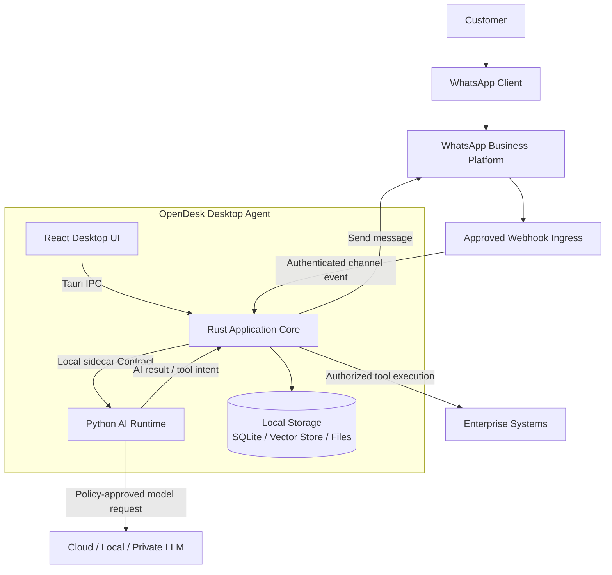
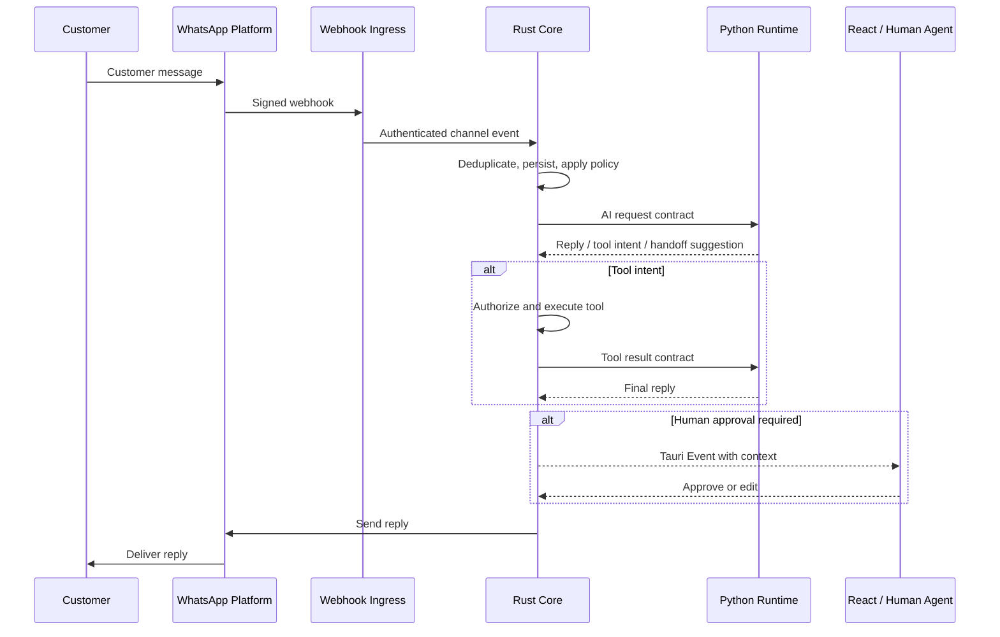

# WhatsApp AI Desktop Agent 产品架构

## 1. 文档定位

本文描述 OpenDesk 面向 WhatsApp 企业客服场景的**目标产品架构**，用于约束后续 React、Rust 与 Python 三端设计。

> 当前仓库仍处于 **Architecture Skeleton** 阶段。已实现的是桌面 UI Shell、Agent Ping 最小纵切、Python sidecar 生命周期与打包基础；本文中的 WhatsApp、RAG、订单工具和人工接管等均为待规划能力，不代表已经交付。

## 2. 产品概述

### 2.1 产品定位

WhatsApp AI Desktop Agent 是面向企业客户的隐私优先 AI 客服桌面系统。它通过受控的 WhatsApp Business 接入接收客户消息，在企业设备上协调知识检索、AI 推理、业务工具与人工客服。

目标场景包括：

- 商品、物流、售后和 FAQ 咨询；
- 多语言自动回复；
- 订单、库存、物流等企业系统查询；
- AI 与人工客服协作；
- 企业知识和业务数据优先保留在受控环境。

### 2.2 产品目标

- 缩短高频咨询的首次响应时间；
- 降低重复性客服工作量；
- 提升多语言服务能力；
- 让企业明确控制数据存储、模型调用和工具权限；
- 在 AI 无法安全处理时可靠转交人工。

### 2.3 核心价值

#### AI 自动客服

处理标准化、高频、低风险问题，例如商品咨询、物流查询、售后流程和 FAQ。

#### 企业数据控制

PDF、商品资料、FAQ、业务规则及会话索引默认由桌面端 Rust Core 管理并存储于企业本地。是否向外部模型发送上下文必须由企业策略明确控制。

#### 人机协作

- AI：高频问题、标准流程、候选回复；
- 人工：投诉、复杂问题、高价值客户和低置信度场景；
- 系统：保留转交原因、上下文和审计记录。

## 3. 架构原则

1. **Rust 是唯一协调者**：React 不直接调用 Python，Python 不直接访问 React。
2. **本地资源归 Rust 管理**：文件、SQLite、向量存储、系统权限和进程生命周期均由 Rust 控制。
3. **Contract First**：跨端变更顺序固定为 Contract → Codegen → Rust → Python → React。
4. **Feature 隔离**：跨 Feature 仅通过 Contract、Event 或 Query Port 协作。
5. **最小权限**：模型、渠道和工具只能访问完成当前任务所需的数据。
6. **可降级、可人工接管**：外部 API、模型或检索失败不能导致消息静默丢失。

## 4. 总体架构



### 4.1 WhatsApp Webhook 接入约束

WhatsApp Cloud API 的 webhook 需要 Meta 可访问的 HTTPS 端点。普通企业桌面设备通常位于 NAT 或防火墙之后，不能假设 Meta 能直接回调本机。

部署时必须选择并评审一种入口：

- 企业自建的公网或私有部署 webhook gateway；
- 厂商托管的最小化 relay，只转发已认证事件且默认不持久化正文；
- 企业网络允许的受控反向通道。

无论采用哪种方式，进入桌面端后的渠道消息都必须先由 Rust Channel Adapter 验证、标准化和审计，再交给 Python。禁止 WhatsApp API 直接调用 Python sidecar。

## 5. 三端职责

### 5.1 React Desktop

负责用户交互：

- 登录、激活与工作区；
- 会话列表、消息查看和候选回复；
- AI 策略与模型配置；
- 知识库管理；
- 人工接管、审批和系统设置。

边界：

- 禁止直接访问 SQLite、文件系统或 Python；
- 通过 `@desk/platform` 调用 Tauri IPC；
- 只消费 Rust 暴露的 Contract 与 Event。

### 5.2 Rust Application Core

负责桌面端协调、安全与基础设施：

- WhatsApp 渠道接入、消息发送和幂等处理；
- Tauri IPC 与应用状态；
- Python sidecar 生命周期及本机通信；
- 文件、SQLite、向量存储和系统权限；
- 工具授权、执行、超时与审计；
- Feature Event、任务调度和错误恢复；
- 数据访问策略与敏感字段过滤。

Rust 不承担 LLM 推理，但决定 Python 可以获得什么数据、可以请求哪些工具。

### 5.3 Python AI Runtime

负责 AI 计算：

- 消息预处理与语言识别；
- Prompt 组装与模型路由；
- Agent 执行与意图判断；
- RAG 切片、Embedding 和检索编排；
- Tool Calling 决策；
- 回复、置信度和人工接管建议。

边界：

- 不负责 UI、桌面文件管理或直接访问 SQLite；
- 不直接接收 WhatsApp webhook，也不直接发送 WhatsApp 消息；
- 业务工具调用必须作为结构化意图返回 Rust，由 Rust 授权并执行；
- 所有 Rust ↔ Python 数据必须使用 `contracts/` 中定义的版本化契约。

## 6. 核心业务流程

### 6.1 客户消息处理



关键要求：

- 使用 WhatsApp message ID 做幂等；
- 保留 trace ID、conversation ID 和策略决策；
- 模型超时或低置信度时进入人工接管；
- 发送失败可重试，但不得重复回复客户。

### 6.2 知识库处理

```text
企业选择文件
→ Rust 校验文件类型、大小和权限
→ Rust 保存原文件与文档元数据
→ Python 解析、清洗和切片
→ Python 生成 Embedding
→ Rust 通过存储 Port 写入向量索引
→ 查询时 Rust 提供授权范围
→ Python 检索并生成带来源的上下文
```

知识库首期支持 PDF、FAQ、商品资料和企业规则。检索结果应包含来源文档、片段位置和相关度，便于解释与审计。

### 6.3 订单与业务工具

```text
客户问题
→ Python 判断工具意图并生成结构化参数
→ Rust 校验租户、权限、参数和工具白名单
→ Rust Adapter 调用企业订单/库存/物流系统
→ Rust 过滤结果并返回 Python
→ Python 生成回复
→ Rust 按策略自动发送或提交人工审批
```

首批候选工具：

- 查询订单；
- 查询库存；
- 查询物流；
- 创建工单。

### 6.4 人工接管

以下情况默认进入人工处理：

- 投诉、退款争议或高风险内容；
- 模型置信度低或知识不足；
- 工具执行失败；
- 客户明确要求人工；
- 企业策略要求审批的高价值客户或敏感操作。

## 7. 数据设计

本地数据由 Rust Storage Port 统一管理。概念实体包括：

- `users`
- `customers`
- `conversations`
- `messages`
- `knowledge_documents`
- `knowledge_chunks`
- `settings`
- `licenses`
- `tool_executions`
- `audit_events`

这些名称仅表示领域概念，不等同于已经批准的物理表结构。正式 Schema、迁移、索引和保留策略必须在对应任务中设计。

向量存储可以采用 SQLite 扩展或独立本地向量引擎，但 Python 不直接持有数据库连接。

## 8. AI 能力

### 8.1 意图与风险识别

识别商品咨询、订单查询、售后、投诉、人工请求及风险等级。分类结果必须包含置信度和可审计理由。

### 8.2 RAG

```text
Document → Parse → Chunk → Embedding → Vector Search
         → Authorized Context → LLM → Cited Answer
```

RAG 必须尊重租户、知识库和文档权限，不允许跨租户检索。

### 8.3 Tool Calling

Python 只生成结构化工具意图；Rust 负责注册、授权和执行工具。任何会改变外部系统状态的工具都应支持审批、幂等和审计。

### 8.4 模型策略

支持云模型、本地模型和企业私有模型。Provider 应可替换，并允许按数据敏感级别、语言、成本和可用性路由。

## 9. 安全与隐私

### 9.1 数据现实

“本地优先”不等于“所有数据永不离开设备”：

- WhatsApp 消息必然经过 Meta 的基础设施；
- 使用云 LLM 时，发送给模型的 Prompt 和上下文会离开本机；
- webhook relay 可能处理消息正文。

产品必须明确披露这些数据路径，并允许企业选择本地/私有模型、私有入口和最小化上下文策略。

### 9.2 控制措施

- 本地数据静态加密和操作系统安全存储；
- WhatsApp token、模型密钥和企业凭据不得写入普通日志；
- webhook 签名验证、重放防护和来源认证；
- 工具白名单、最小权限和参数校验；
- 租户隔离、审计日志和数据保留策略；
- 发送云模型前进行敏感数据过滤；
- 桌面端、sidecar 和安装包签名；
- sidecar 只监听 loopback，并采用进程归属或会话认证机制。

## 10. 非功能要求

- **可靠性**：消息幂等、可重试、可恢复，不静默丢失；
- **可观察性**：跨 React、Rust、Python 和渠道使用统一 trace ID；
- **性能**：长耗时 AI 任务不阻塞 UI 与消息接入；
- **可维护性**：契约版本化、Provider 可替换、Feature 独立；
- **可测试性**：渠道、模型、工具和存储均通过 Port 支持 Mock；
- **离线能力**：本地知识管理可离线；WhatsApp 与云模型能力需要网络。

## 11. 交付阶段

### 阶段 0：架构与运行时基线

- UI Shell；
- Contract/codegen；
- Rust ↔ Python 最小纵切；
- sidecar 生命周期、日志与生产打包。

### 阶段 1：WhatsApp MVP

- 受控 webhook ingress；
- 渠道消息收发与幂等；
- 单一模型 Provider；
- 会话上下文；
- 基础知识库；
- 人工接管；
- 安全与审计基线。

### 阶段 2：智能化增强

- RAG 质量优化；
- Tool Calling；
- 多语言；
- 模型路由与降级；
- 自动化评测。

### 阶段 3：企业能力

- 私有部署；
- 多用户与角色权限；
- 多租户隔离；
- 合规策略与集中运维。

### 阶段 4：多渠道

- Web Chat；
- Instagram；
- Email；
- 其他经统一 Channel Port 接入的渠道。

## 12. 相关文档

- `PYTHON_AI_RUNTIME_ARCHITECTURE.md`：Python AI Runtime 的工程边界与目标结构；
- `AGENTS.md`：仓库级架构和开发门禁；
- `skills/opendesk/architecture/overview.md`：OpenDesk 三层架构；
- `contracts/README.md`：跨端契约流程。
