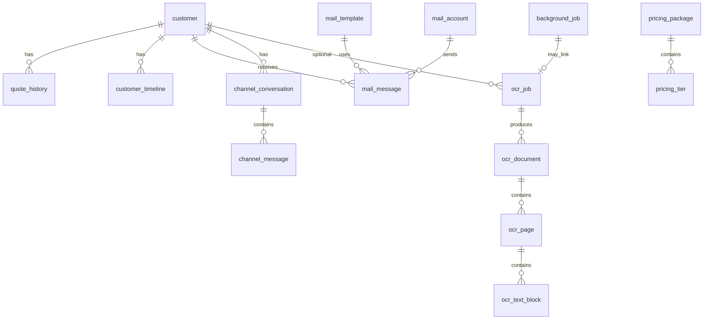

# OpenDesk 本地数据库设计

## 1. 文档定位

本文是 OpenDesk **SQLite  schema 的唯一设计参考**（规划态，MVP 实施前以本文为准）。

- **回答**：有哪些库文件、哪些表、字段、索引、外键、与领域的对应关系。
- **不回答**：Diesel 代码细节、Migration 文件名（由 Change Record 实施时生成）。

相关：

- 进程隔离（OCR / 重任务不进 UI 进程）：[`process-model.md`](process-model.md)
- 存储领域：[`../managed/domains/storage/README.md`](../managed/domains/storage/README.md)
- OCR 领域：[`../managed/domains/ocr/README.md`](../managed/domains/ocr/README.md)

## 2. 库文件划分

| 文件 | 路径（桌面数据目录） | 职责 | 访问者 |
|------|----------------------|------|--------|
| `crawler.db` | `{data_local}/OpenDesk/crawler.db` | 爬虫关键词、频道结果、爬虫设置 | **已实现**；Tauri 主进程只读/写爬虫表 |
| `opendesk.db` | `{data_local}/OpenDesk/opendesk.db` | CRM、邮件、价目表、渠道、OCR、后台任务 | Tauri 主进程（轻量 SQL）；**Worker 进程**（OCR/重任务） |

**原则：**

- 不把 CRM 与爬虫混在同一库（已运行的 `crawler.db` 保持不变）。
- 所有 **CPU/IO 密集** 写路径（OCR 识别、大文件处理）在 **Worker 进程** 执行，经 `background_job` 协调；主进程只做入队、查状态、读结果。
- Python Sidecar **不连接** 任一 SQLite（架构硬约束）。

## 3. 总 ER 关系（opendesk.db）



## 4. 枚举约定（TEXT 存储）

| 枚举 | 值 |
|------|-----|
| `lifecycle_status` | `new`, `contacted`, `negotiating`, `won`, `lost`, `paused` |
| `cooperation_status` | `none`, `negotiating`, `active`, `paused`, `terminated` |
| `source_channel` | `youtube`, `manual`, `import` |
| `template_intent` | `first_contact`, `follow_up`, `quote_proposal`, `quote_revision`, `cooperation_confirm`, `custom` |
| `mail_message.status` | `draft`, `sending`, `sent`, `failed` |
| `timeline_entry_type` | `email_sent`, `email_received`, `wa_in`, `wa_out`, `note`, `quote_changed`, `cooperation_changed`, `ocr_completed` |
| `channel_message.direction` | `inbound`, `outbound` |
| `ocr_job.status` | `queued`, `running`, `completed`, `failed`, `cancelled` |
| `ocr_language_pack.status` | `not_installed`, `downloading`, `installed`, `failed` |
| `background_job.job_type` | `ocr`, `mail_send`, `imap_sync`, `crawler_email_enrich`, `crawler_batch`（预留） |
| `background_job.status` | `queued`, `running`, `completed`, `failed`, `cancelled` |

---

## 5. opendesk.db 表定义

### 5.1 Customer 领域（M1 / CHG-013）

#### `customer`

```sql
CREATE TABLE customer (
    id              TEXT PRIMARY KEY NOT NULL,  -- UUID v4
    display_name    TEXT,
    email           TEXT NOT NULL,
    whatsapp_phone  TEXT,
    source_channel  TEXT NOT NULL DEFAULT 'manual',
    source_meta     TEXT,                       -- JSON: youtube channel_id, title, url, ...
    lifecycle_status TEXT NOT NULL DEFAULT 'new',
    quoted_price    REAL,
    quoted_currency TEXT,
    quoted_at       TEXT,                       -- ISO-8601 UTC
    pricing_tier    TEXT,
    cooperation_status TEXT NOT NULL DEFAULT 'none',
    package_name    TEXT,
    monthly_fee     REAL,
    contract_start  TEXT,                       -- YYYY-MM-DD
    contract_end    TEXT,
    notes           TEXT,
    created_at      TEXT NOT NULL,
    updated_at      TEXT NOT NULL,
    UNIQUE(email)
);

CREATE INDEX idx_customer_lifecycle ON customer(lifecycle_status);
CREATE INDEX idx_customer_cooperation ON customer(cooperation_status);
CREATE INDEX idx_customer_updated ON customer(updated_at DESC);
```

#### `quote_history`

```sql
CREATE TABLE quote_history (
    id              TEXT PRIMARY KEY NOT NULL,
    customer_id     TEXT NOT NULL REFERENCES customer(id) ON DELETE CASCADE,
    old_price       REAL,
    new_price       REAL,
    currency        TEXT,
    old_tier        TEXT,
    new_tier        TEXT,
    reason          TEXT,
    changed_by      TEXT,                       -- 本地操作者标识
    created_at      TEXT NOT NULL
);

CREATE INDEX idx_quote_history_customer ON quote_history(customer_id, created_at DESC);
```

#### `customer_timeline`

```sql
CREATE TABLE customer_timeline (
    id              TEXT PRIMARY KEY NOT NULL,
    customer_id     TEXT NOT NULL REFERENCES customer(id) ON DELETE CASCADE,
    entry_type      TEXT NOT NULL,
    ref_id          TEXT,                       -- mail_message.id / channel_message.id / ocr_job.id
    summary         TEXT NOT NULL,
    metadata_json   TEXT,
    created_at      TEXT NOT NULL
);

CREATE INDEX idx_timeline_customer ON customer_timeline(customer_id, created_at DESC);
```

#### `cooperation_audit`（M4 / CHG-019）

```sql
CREATE TABLE cooperation_audit (
    id              TEXT PRIMARY KEY NOT NULL,
    customer_id     TEXT NOT NULL REFERENCES customer(id) ON DELETE CASCADE,
    field_name      TEXT NOT NULL,
    old_value       TEXT,
    new_value       TEXT,
    changed_by      TEXT,
    created_at      TEXT NOT NULL
);

CREATE INDEX idx_cooperation_audit_customer ON cooperation_audit(customer_id, created_at DESC);
```

---

### 5.2 Mail 领域（M2 / CHG-015）

#### `mail_template`

```sql
CREATE TABLE mail_template (
    id                  TEXT PRIMARY KEY NOT NULL,
    name                TEXT NOT NULL,
    template_intent     TEXT NOT NULL,
    subject_template    TEXT NOT NULL,
    body_text_template  TEXT NOT NULL,
    body_html_template  TEXT,
    locale              TEXT,
    is_system           INTEGER NOT NULL DEFAULT 0,
    is_active           INTEGER NOT NULL DEFAULT 1,
    sort_order          INTEGER NOT NULL DEFAULT 0,
    created_at          TEXT NOT NULL,
    updated_at          TEXT NOT NULL
);

CREATE INDEX idx_mail_template_intent ON mail_template(template_intent, is_active);
```

#### `mail_account`

```sql
CREATE TABLE mail_account (
    id              TEXT PRIMARY KEY NOT NULL,
    label           TEXT NOT NULL,
    smtp_host       TEXT NOT NULL,
    smtp_port       INTEGER NOT NULL,
    imap_host       TEXT,                       -- CHG-029；空则不同步
    imap_port       INTEGER,
    imap_use_tls    INTEGER NOT NULL DEFAULT 1,
    imap_sync_enabled INTEGER NOT NULL DEFAULT 0,
    username        TEXT NOT NULL,
    password_ref    TEXT NOT NULL,              -- OS keychain / secure store key
    from_address    TEXT NOT NULL,
    from_name       TEXT,
    use_tls         INTEGER NOT NULL DEFAULT 1,
    is_default      INTEGER NOT NULL DEFAULT 0,
    created_at      TEXT NOT NULL,
    updated_at      TEXT NOT NULL
);
```

#### `mail_sync_state`（M2 / CHG-029）

```sql
CREATE TABLE mail_sync_state (
    account_id      TEXT PRIMARY KEY NOT NULL REFERENCES mail_account(id) ON DELETE CASCADE,
    folder          TEXT NOT NULL DEFAULT 'INBOX',
    last_uid        INTEGER NOT NULL DEFAULT 0,
    last_sync_at    TEXT,
    last_error      TEXT
);
```

#### `mail_message`

```sql
CREATE TABLE mail_message (
    id              TEXT PRIMARY KEY NOT NULL,
    customer_id     TEXT REFERENCES customer(id),   -- 入站未匹配时可 NULL（CHG-029）
    template_id     TEXT REFERENCES mail_template(id),
    account_id      TEXT NOT NULL REFERENCES mail_account(id),
    direction       TEXT NOT NULL DEFAULT 'outbound', -- outbound | inbound
    subject         TEXT NOT NULL,
    body_text       TEXT NOT NULL,
    body_html       TEXT,
    status          TEXT NOT NULL DEFAULT 'draft',    -- 入站为 received
    rfc_message_id  TEXT,                           -- IMAP Message-ID；UNIQUE
    imap_uid        INTEGER,
    in_reply_to     TEXT,
    error_message   TEXT,
    sent_at         TEXT,
    received_at     TEXT,                           -- 入站收到时间
    created_at      TEXT NOT NULL,
    updated_at      TEXT NOT NULL,
    UNIQUE(rfc_message_id)
);

CREATE INDEX idx_mail_message_customer ON mail_message(customer_id, created_at DESC);
CREATE INDEX idx_mail_message_status ON mail_message(status);
CREATE INDEX idx_mail_message_direction ON mail_message(direction, received_at DESC);
CREATE INDEX idx_mail_message_unmatched ON mail_message(customer_id) WHERE customer_id IS NULL AND direction = 'inbound';
```

---

### 5.2b Agent 纠错（M3 / CHG-030）

#### `ai_correction`

```sql
CREATE TABLE ai_correction (
    id              TEXT PRIMARY KEY NOT NULL,
    scope           TEXT NOT NULL,                  -- global | customer
    customer_id     TEXT REFERENCES customer(id) ON DELETE CASCADE,
    task_type       TEXT NOT NULL,                  -- mail_draft | wa_suggest | wa_translate | all
    category        TEXT NOT NULL,
    rule_text       TEXT NOT NULL,
    example_bad     TEXT,
    example_good    TEXT,
    source_task_id  TEXT,
    is_active       INTEGER NOT NULL DEFAULT 1,
    created_by      TEXT,
    created_at      TEXT NOT NULL,
    CHECK (scope != 'customer' OR customer_id IS NOT NULL)
);

CREATE INDEX idx_ai_correction_customer ON ai_correction(customer_id, task_type, is_active);
CREATE INDEX idx_ai_correction_global ON ai_correction(scope, task_type, is_active) WHERE scope = 'global';
```

---

### 5.3 Pricing 领域（M3 / CHG-016）

#### `pricing_package`

```sql
CREATE TABLE pricing_package (
    id              TEXT PRIMARY KEY NOT NULL,
    name            TEXT NOT NULL,
    description     TEXT,
    currency        TEXT NOT NULL DEFAULT 'USD',
    is_active       INTEGER NOT NULL DEFAULT 1,
    sort_order      INTEGER NOT NULL DEFAULT 0,
    created_at      TEXT NOT NULL,
    updated_at      TEXT NOT NULL
);
```

#### `pricing_tier`

```sql
CREATE TABLE pricing_tier (
    id              TEXT PRIMARY KEY NOT NULL,
    package_id      TEXT NOT NULL REFERENCES pricing_package(id) ON DELETE CASCADE,
    tier_name       TEXT NOT NULL,
    min_quantity    INTEGER,
    max_quantity    INTEGER,
    unit_price      REAL,
    monthly_fee     REAL,
    conditions_json TEXT,
    sort_order      INTEGER NOT NULL DEFAULT 0,
    created_at      TEXT NOT NULL,
    updated_at      TEXT NOT NULL
);

CREATE INDEX idx_pricing_tier_package ON pricing_tier(package_id, sort_order);
```

---

### 5.4 Channel 领域（M5 / CHG-020）

#### `channel_conversation`

```sql
CREATE TABLE channel_conversation (
    id              TEXT PRIMARY KEY NOT NULL,
    customer_id     TEXT NOT NULL REFERENCES customer(id),
    wa_phone        TEXT NOT NULL,
    wa_conversation_ref TEXT,
    last_message_at TEXT,
    created_at      TEXT NOT NULL,
    updated_at      TEXT NOT NULL,
    UNIQUE(customer_id, wa_phone)
);

CREATE INDEX idx_channel_conv_customer ON channel_conversation(customer_id);
```

#### `channel_message`

```sql
CREATE TABLE channel_message (
    id              TEXT PRIMARY KEY NOT NULL,
    conversation_id TEXT NOT NULL REFERENCES channel_conversation(id) ON DELETE CASCADE,
    direction       TEXT NOT NULL,
    body            TEXT NOT NULL,
    translated_body TEXT,
    wa_message_id   TEXT NOT NULL,
    sent_by         TEXT NOT NULL DEFAULT 'human',
    created_at      TEXT NOT NULL,
    UNIQUE(wa_message_id)
);

CREATE INDEX idx_channel_msg_conv ON channel_message(conversation_id, created_at DESC);
```

---

### 5.5 OCR 领域（M6 / Worker 进程 + Tesseract）

> OCR **禁止**在 Tauri UI 主进程内执行识别；引擎为 **Tesseract**（ADR-0003）；`tessdata` **不随安装包分发**，用户在前端按需下载。

#### `ocr_language_pack`

语言模型目录与用户安装状态（种子行 = 可下载项，非预装文件）。

```sql
CREATE TABLE ocr_language_pack (
    id                  TEXT PRIMARY KEY NOT NULL,   -- 语言代码：eng, chi_sim, ...
    display_name        TEXT NOT NULL,
    local_filename      TEXT NOT NULL,               -- eng.traineddata
    download_url        TEXT NOT NULL,               -- HTTPS 直链
    expected_sha256     TEXT,                        -- 可选校验
    status              TEXT NOT NULL DEFAULT 'not_installed',
    bytes_total         INTEGER,
    bytes_downloaded    INTEGER,
    installed_at        TEXT,
    error_message       TEXT,
    is_suggested        INTEGER NOT NULL DEFAULT 0,  -- UI 推荐标记
    sort_order          INTEGER NOT NULL DEFAULT 0
);

CREATE INDEX idx_ocr_language_pack_status ON ocr_language_pack(status);
```

**`status` 枚举：** `not_installed` | `downloading` | `installed` | `failed`

**磁盘路径（与表分离）：** `{data_local}/OpenDesk/tessdata/{local_filename}` — 仅当用户点击下载后存在。

**种子数据（Migration insert，非文件拷贝）：** 至少 `eng`、`chi_sim`、`chi_tra`，初始均为 `not_installed`。

#### `ocr_job`

```sql
CREATE TABLE ocr_job (
    id              TEXT PRIMARY KEY NOT NULL,
    background_job_id TEXT NOT NULL REFERENCES background_job(id),
    customer_id     TEXT REFERENCES customer(id),
    source_path     TEXT NOT NULL,              -- 原文件绝对路径（Rust 校验后登记）
    source_mime     TEXT,
    source_sha256   TEXT,
    language_codes  TEXT NOT NULL,              -- JSON 数组，如 ["eng","chi_sim"]
    status          TEXT NOT NULL DEFAULT 'queued',
    page_count      INTEGER,
    error_message   TEXT,
    created_at      TEXT NOT NULL,
    completed_at    TEXT
);

CREATE INDEX idx_ocr_job_customer ON ocr_job(customer_id);
CREATE INDEX idx_ocr_job_status ON ocr_job(status);
```

#### `ocr_document`

```sql
CREATE TABLE ocr_document (
    id              TEXT PRIMARY KEY NOT NULL,
    job_id          TEXT NOT NULL REFERENCES ocr_job(id) ON DELETE CASCADE,
    title           TEXT,
    language_hint   TEXT,
    created_at      TEXT NOT NULL
);
```

#### `ocr_page`

```sql
CREATE TABLE ocr_page (
    id              TEXT PRIMARY KEY NOT NULL,
    document_id     TEXT NOT NULL REFERENCES ocr_document(id) ON DELETE CASCADE,
    page_index      INTEGER NOT NULL,
    image_path      TEXT,                       -- 渲染页缓存路径
    width           INTEGER,
    height          INTEGER,
    status          TEXT NOT NULL DEFAULT 'pending',
    UNIQUE(document_id, page_index)
);
```

#### `ocr_text_block`

```sql
CREATE TABLE ocr_text_block (
    id              TEXT PRIMARY KEY NOT NULL,
    page_id         TEXT NOT NULL REFERENCES ocr_page(id) ON DELETE CASCADE,
    block_index     INTEGER NOT NULL,
    bbox_json       TEXT NOT NULL,              -- [x,y,w,h] 归一化或像素坐标
    text            TEXT NOT NULL,
    confidence      REAL,
    UNIQUE(page_id, block_index)
);

CREATE INDEX idx_ocr_text_page ON ocr_text_block(page_id);
```

---

### 5.6 后台任务（Worker 协调）

所有重任务统一经 `background_job` 入队；UI 进程 **只插入 queued 记录**，不执行 `job_type` 对应的计算。

#### `background_job`

```sql
CREATE TABLE background_job (
    id              TEXT PRIMARY KEY NOT NULL,
    job_type        TEXT NOT NULL,
    payload_json    TEXT NOT NULL,
    status          TEXT NOT NULL DEFAULT 'queued',
    progress        REAL NOT NULL DEFAULT 0,
    error_message   TEXT,
    worker_pid      INTEGER,
    created_at      TEXT NOT NULL,
    started_at      TEXT,
    completed_at    TEXT
);

CREATE INDEX idx_background_job_queue ON background_job(status, created_at);
CREATE INDEX idx_background_job_type ON background_job(job_type, status);
```

**`payload_json` 示例：**

```json
{ "ocr_job_id": "...", "source_path": "...", "language_codes": ["eng"], "options": {} }
```

---

## 6. crawler.db 增量（M1 / CHG-014、CHG-031）

在既有表上增加导入回写字段（Migration 增量，不破坏现有数据）：

```sql
ALTER TABLE crawler_channel ADD COLUMN imported_customer_id TEXT;
ALTER TABLE crawler_channel ADD COLUMN imported_at TEXT;

CREATE INDEX idx_crawler_channel_imported
    ON crawler_channel(imported_customer_id)
    WHERE imported_customer_id IS NOT NULL;
```

**CHG-031 邮箱补全状态**（两阶段获取，不丢弃无邮箱频道）：

```sql
ALTER TABLE crawler_channel ADD COLUMN email_status TEXT NOT NULL DEFAULT 'pending_enrich';
ALTER TABLE crawler_channel ADD COLUMN enrich_attempts INTEGER NOT NULL DEFAULT 0;
ALTER TABLE crawler_channel ADD COLUMN enrich_error TEXT;
ALTER TABLE crawler_channel ADD COLUMN enriched_at TEXT;

CREATE INDEX idx_crawler_channel_email_status
    ON crawler_channel(job_id, email_status);
```

`email_status` 枚举：`found_api` | `pending_enrich` | `enriching` | `found_playwright` | `not_found` | `enrich_failed`。

`opendesk.db.background_job.job_type` 增加 `crawler_email_enrich`（Worker Playwright 补全，见 CHG-031）。

`imported_customer_id` 逻辑外键指向 `opendesk.db.customer.id`（跨库不建 FK，应用层校验）。

---

## 7. 迁移与版本

### 7.1 `__diesel_schema_migrations`

各库使用 Diesel 内置迁移表；应用启动时自动 `run_pending_migrations`。

### 7.2 Migration 顺序

| 库 | Migration 前缀建议 | 首批 Migration |
|----|-------------------|----------------|
| `opendesk.db` | `2026-08-*` | `create_customer_tables` → `create_mail_tables` → `create_pricing_tables` → `create_channel_tables` → `create_worker_ocr_tables` |
| `crawler.db` | `2026-07-*` | 已有；追加 `add_imported_customer_id` |

启动时：

```text
PRAGMA foreign_keys = ON;
PRAGMA journal_mode = WAL;   -- 允许多进程读；Worker 写时主进程仍可读状态
```

**WAL 注意：** Worker 与主进程可同时打开 `opendesk.db`；Worker 负责长事务 OCR 写入，主进程只做短查询与入队。见 [`process-model.md`](process-model.md)。

### 7.3 实施与表归属

| Migration 批次 | Change | 表 |
|----------------|--------|-----|
| 基础队列 | CHG-023 | `background_job` |
| Customer | CHG-013 | `customer`, `quote_history`, `customer_timeline` |
| Mail | CHG-015 | `mail_template`, `mail_account`, `mail_message` |
| Pricing | CHG-016 | `pricing_package`, `pricing_tier` |
| Customer 审计 | CHG-019 | `cooperation_audit` |
| Channel | CHG-020 | `channel_conversation`, `channel_message` |
| OCR | CHG-025, CHG-024 | `ocr_language_pack`, `ocr_job`, `ocr_document`, `ocr_page`, `ocr_text_block` |

所有 Migration 文件位于 `crates/storage/migrations/opendesk/`，共用 `opendesk_db` Diesel 模块。

---

## 8. 领域 ↔ 表 速查

| 领域 | 表 |
|------|-----|
| Customer | `customer`, `quote_history`, `customer_timeline`, `cooperation_audit` |
| Mail | `mail_template`, `mail_account`, `mail_message` |
| Pricing | `pricing_package`, `pricing_tier` |
| Channel | `channel_conversation`, `channel_message` |
| OCR | `ocr_language_pack`, `ocr_job`, `ocr_document`, `ocr_page`, `ocr_text_block` |
| Runtime/Worker | `background_job` |
| Crawler | `crawler_keyword`, `crawler_channel`, `crawler_setting`（`crawler.db`） |

---

## 9. AI 只读 Query Port 可见表

AI（经 ADR-0001）**仅可读**：

- `customer`, `quote_history`, `customer_timeline`
- `pricing_package`, `pricing_tier`
- OCR 结果只读（可选后续工具 `ocr.get_text`）：`ocr_job`, `ocr_text_block` 聚合
- `ocr_language_pack`：仅状态与元数据；**不含**模型二进制

**不可读：** `mail_account.password_ref`、`background_job.payload_json` 中的敏感路径细节（Query Port 须脱敏）。

---

## 10. 相关 Change

| Change | 内容 |
|--------|------|
| [CHG-013](../managed/changes/2026/07/chg-20260720-013-customer-profile-model.md) | Customer 表实施 |
| [CHG-015](../managed/changes/2026/07/chg-20260720-015-smtp-mail-send.md) | Mail 表实施 |
| [CHG-025](../managed/changes/2026/07/chg-20260720-025-ocr-tesseract-model-download.md) | Tesseract 语言包按需下载 |
| [CHG-024](../managed/changes/2026/07/chg-20260720-024-ocr-worker-pipeline.md) | OCR Worker 管线 |
