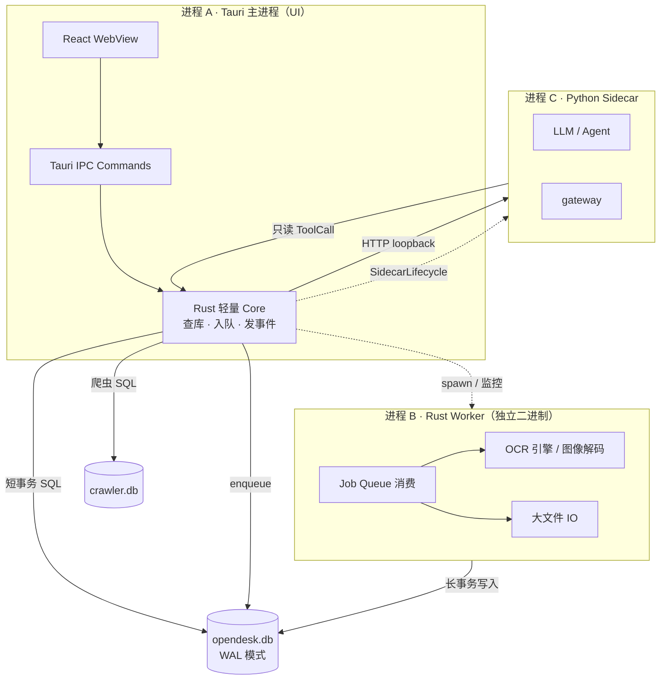
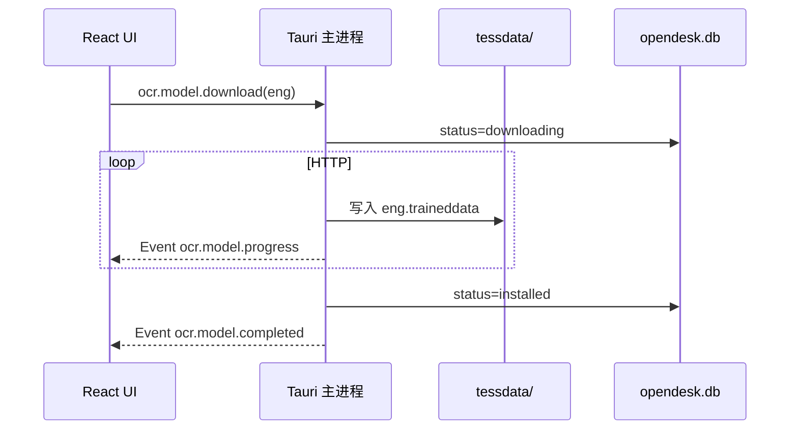
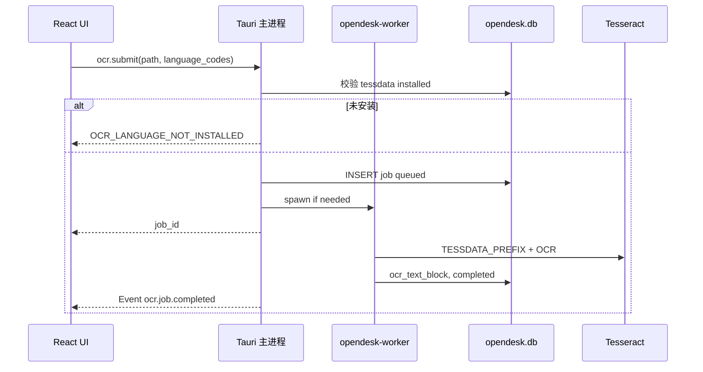

# OpenDesk 进程模型

## 1. 文档定位

本文定义 OpenDesk 桌面端的 **进程边界**：哪些工作在哪个进程执行，以及如何保证 **重任务不阻塞 UI**。

硬约束（产品 + 架构）：

> **Rust 处理 OCR、批量 IO、长耗时任务时，不得在 Tauri UI 主进程内执行；必须单独 Worker 进程。**

## 2. 进程一览



| 进程 | 二进制 | 职责 | 禁止 |
|------|--------|------|------|
| **A · Tauri 主进程** | `opendesk`（桌面 exe） | UI、Tauri IPC、轻量 SQL、任务入队、SMTP/WA **发起**（短连接）、Sidecar 管理 | OCR 识别、PDF 全量渲染、阻塞 >100ms 的 CPU 密集计算 |
| **B · Rust Worker** | `opendesk-worker`（规划） | **Tesseract** OCR、页图渲染、批量文件处理 | WebView；tessdata 下载 |
| **C · Python Sidecar** | `sidecar` | LLM、Agent、翻译/邮件润色 | SQLite；WhatsApp/SMTP 直连 |

## 3. UI 主进程 vs Worker 分工

### 3.1 必须在 UI 主进程（可接受耗时）

- 客户/模板/价目表 CRUD（单行、索引查询）
- 邮件模板变量渲染（字符串替换，无 OCR）
- SMTP 发送单次请求（async，不阻塞 UI 线程）
- WhatsApp webhook 入库（单条消息）
- **tessdata 语言包下载**（用户点击触发；HTTP async + 进度 Event，非安装时捆绑）
- 读取 OCR **结果**（已写入 DB 的文本）

### 3.2 必须在 Worker 进程

| 任务 | 原因 |
|------|------|
| OCR（**Tesseract** 图片/PDF/扫描件） | CPU 密集；须已安装 tessdata（ADR-0003） |
| PDF 转页图 | 内存与 CPU 峰值高 |
| 批量导入大 CSV/附件解析 | 长 IO |
| 未来：爬虫大批量后处理（若从主进程迁出） | 与 OCR 同模式 |

### 3.3 通信模式（MVP 设计）

```text
1. UI: IPC job.enqueue({ job_type: "ocr", payload })
2. 主进程 Rust: INSERT background_job + ocr_job, status=queued
3. 主进程: 若 Worker 未运行 → spawn opendesk-worker（或常驻）
4. Worker: SELECT ... WHERE status=queued FOR UPDATE（或应用层锁）
5. Worker: 执行 OCR → 写 ocr_page / ocr_text_block → UPDATE status
6. Worker: 可选写 customer_timeline(ocr_completed)
7. 主进程: EventBus → Tauri Event → React 刷新进度/结果
```

**禁止：** Worker 回调 Tauri 窗口；UI 更新只经 **DB 状态 + Event**。

## 4. OCR 端到端流程

### 4.1 语言包下载（用户点击，主进程）

引擎：**Tesseract**。模型：**本地 `tessdata`**，**安装包不包含**；用户在 OCR/设置页选择下载。



### 4.2 识别任务（Worker + Tesseract）



可选后续：OCR 文本经 Python Sidecar 摘要（主进程传入文本）。

## 5. 与现有 Crawler 的关系

当前 YouTube 爬虫在 **Tauri 主进程内** `CrawlerService` 运行（已有实现）。

| 项 | 现状 | 目标 |
|----|------|------|
| 爬虫 | 主进程 in-process | MVP 可保持；文档标记 **未来可迁 Worker** |
| OCR | 未实现 | **Worker + Tesseract**；语言包 **用户按需下载** |

迁爬虫到 Worker 时复用同一 `background_job` 表，不新造队列。

## 6. 失败与取消

- UI 请求取消 → 主进程 `background_job.status = cancelled` → Worker 轮询后优雅停止
- Worker 崩溃 → 主进程健康检查将 job 标 `failed`，可重试入队
- Worker **不得**拖垮 UI：主进程不 join Worker 线程做 OCR

## 7. 相关文档

| 文档 | 内容 |
|------|------|
| [`database-schema.md`](database-schema.md) | OCR / background_job 表结构 |
| [ADR-0002](../managed/decisions/runtime/adr-0002-heavy-work-worker-process.md) | Worker 进程长期决策 |
| [ADR-0003](../managed/decisions/ocr/adr-0003-tesseract-local-model-on-demand-download.md) | Tesseract + 按需下载 |
| [OCR Domain](../managed/domains/ocr/README.md) | OCR 职责边界 |
| [Storage Domain](../managed/domains/storage/README.md) | 双库与 Migration |
