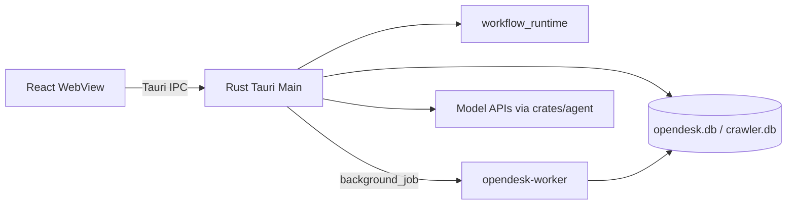

# OpenDesk 进程模型

## 进程与执行边界

```mermaid
flowchart LR
  React[React WebView] -->|Tauri IPC| Main[Rust Tauri Main]
  Main --> DB[(opendesk.db / crawler.db)]
  Main --> WF[workflow_runtime]
  Main -->|background_job| Worker[opendesk-worker]
  Worker --> DB
  Main --> LLM[Model APIs via crates/agent]
```

| 边界 | 职责 |
|---|---|
| Tauri 主进程 | IPC、轻量业务、async 网络/数据库、任务调度、Event |
| `workflow_runtime` | 同进程 DAG、状态机、Executor、检查点、恢复 |
| `opendesk-worker` | 独立进程轮询后台任务、隔离长耗时/可重试工作 |

## 当前事实

- Worker 已轮询 `background_job`，注册 `imap_sync` 与 `crawler_email_enrich`。
- IMAP 已支持手动/周期增量同步和每账户 IDLE watcher；消息持久化后更新 cursor，未匹配消息可人工关联客户。
- Workflow Runtime 已提供 DAG、状态转换、重试、取消/恢复和内存检查点接口。
- LLM 请求由 Rust `crates/agent`（`agent::llm`）直接执行。

## 约束

- CPU 密集或批量任务不得阻塞 Tauri 主线程。
- 阻塞协议调用放入 `spawn_blocking` 或 Worker。
- Worker 不回调 WebView；UI 通过 Tauri Event 或查询持久化状态更新。
- 任务应幂等，状态更新与副作用顺序必须支持崩溃恢复。
- 凭据只在执行边界读取并脱敏记录。
