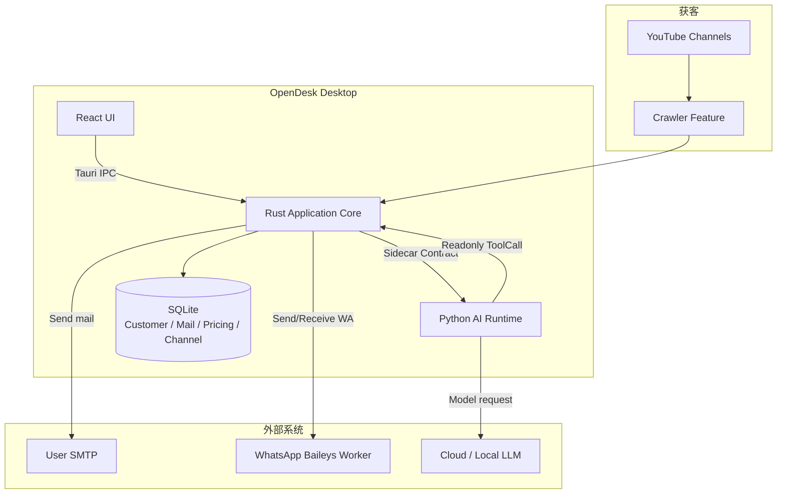
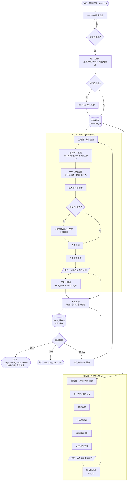
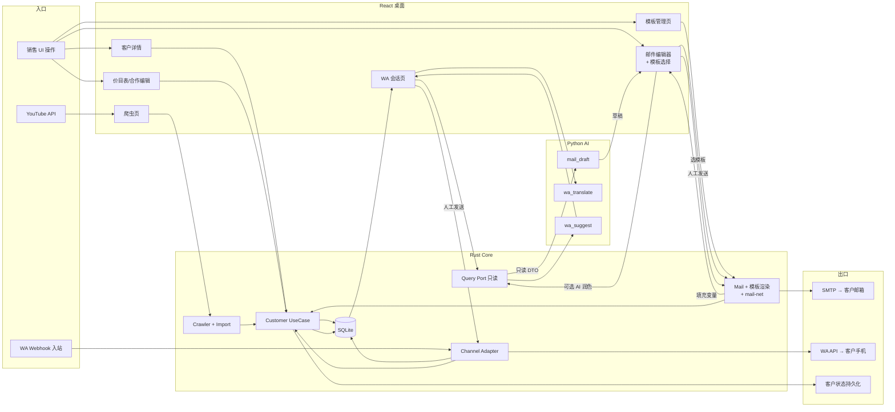
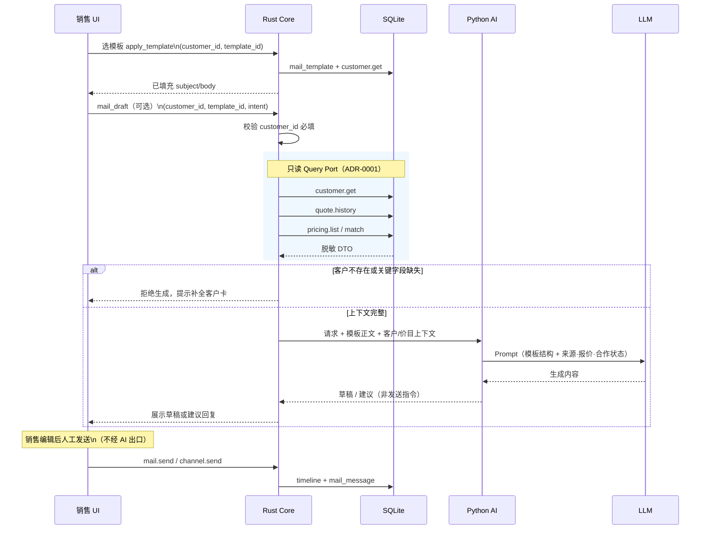

# OpenDesk 产品架构

## 1. 文档定位

本文描述 OpenDesk **商务工作台**的目标产品架构：YouTube 获客 → 邮件谈价 → WhatsApp 桌面辅助（翻译/建议，人发）。

> **当前仓库阶段：** Architecture Skeleton + 部分垂直切片（UI Shell、Agent Ping、YouTube 爬虫、Sidecar 生命周期）。客户档案、SMTP/IMAP 邮件、价目表、AI 只读查库、WhatsApp Baileys 等 **尚未交付**。

**实施级任务分解**不在本文重复，见 [`docs/managed/roadmaps/mvp-sales-workbench.md`](../managed/roadmaps/mvp-sales-workbench.md) 及下属 Epic / Change Record。

## 2. 产品概述

### 2.1 定位

OpenDesk 是面向 B2B 商务场景的 **本地优先 AI 商务桌面**：从 YouTube 等渠道获取潜客邮箱，通过 **自有 SMTP/IMAP** 邮件讨论价格与推进合作；WhatsApp 作为 **辅助渠道**——在桌面通过 **Baileys 协议桥**查看消息、自动翻译、AI 建议回复，**由人工点击发送**。

### 2.2 不是什么

- **不是** WhatsApp 自动客服 / 无人值守自动回复
- **不是** 通用在线客服 FAQ 机器人
- **不是** AI 自动改报价、改合作状态或自动发信

### 2.3 核心价值

| 能力 | 说明 |
|------|------|
| 获客 | YouTube 爬虫从频道简介提取邮箱与来源元数据 |
| 邮件谈价 | 主商务通道；**邮件模板** + SMTP 发信；往来留痕 |
| 客户记忆 | 每位客户的来源、报价、合作套餐/月费/合约、沟通历史结构化存储 |
| AI 辅助 | 懂价目表与客户档案；**只读查库**；起草邮件 / 建议 WA 回复 |
| WhatsApp 辅助 | **Baileys 协议桥**（Worker）桌面收发；翻译 + 建议；**人发** |

## 3. 架构原则

1. **Rust 是唯一协调者**：React 不直连 Python；Python 不直连 SQLite。
2. **Contract First**：跨端顺序 Contract → Codegen → Rust → Python → React。
3. **Feature 隔离**：跨 Feature 仅 Contract、Event、Query Port。
4. **AI 只读业务库**：查客户/价目表经 Rust 白名单 Query Port（[ADR-0001](../managed/decisions/customer/adr-0001-ai-readonly-query-port.md)）。
5. **发送与改状态由人操作**：邮件/WA 发送、报价/合作变更仅在 UI 触发。
6. **AI 纠错仅人写、Rust 注入**：见 [ADR-0005](../managed/decisions/agent/adr-0005-ai-correction-memory.md)。
7. **客户上下文不依赖模型记忆**：每次 AI 生成前 Rust 拉取该客户档案与纠错规则。

## 4. 总体架构



### 4.1 进程模型（OCR / 重任务）

除 Sidecar 外，桌面端还有 **Rust Worker 独立进程**：

| 进程 | 职责 | OCR / 模型 |
|------|------|------------|
| Tauri 主进程 | UI、IPC、入队、**用户点击下载 tessdata** | **禁止** Tesseract 识别 |
| `opendesk-worker` | **Tesseract** 识别、重 IO | **禁止** 下载模型 |
| Python Sidecar | LLM / Agent | 仅接收已 OCR 文本（可选） |

详见 [`process-model.md`](process-model.md)、[ADR-0002](../managed/decisions/runtime/adr-0002-heavy-work-worker-process.md)、[ADR-0003](../managed/decisions/ocr/adr-0003-tesseract-local-model-on-demand-download.md)。

## 5. 三端职责

### 5.1 React Desktop

- 客户列表/详情（来源、报价、合作字段 B）
- 爬虫结果与「导入为客户」
- 邮件撰写、**模板选择/管理**、SMTP 配置、发信、**记录客户回复**
- 价目表管理
- **LLM Provider 配置**（设置页）
- WhatsApp 会话、翻译、回复建议
- OCR 语言包管理（**用户点击下载** Tesseract 模型，安装包不附带）
- AI 起草面板（填入编辑器，人审后发）

**禁止：** 直连 Python、SQLite、SMTP。

### 5.2 Rust Application Core

- 客户/报价/合作/时间线持久化
- **邮件模板** CRUD、变量渲染（客户/价目/发件人 → 主题与正文）
- SMTP 发信（`mail-net`）
- WhatsApp **Baileys 协议桥**适配（`channel` + `opendesk-worker`）
- AI 只读 Query Port 执行与脱敏
- Sidecar 生命周期、审计、密钥存储
- 爬虫结果导入客户
- **tessdata 下载**（HTTP，用户触发；非安装时捆绑）

**禁止：** LLM 推理；**Tesseract 识别**（须在 Worker）

### 5.3 Python AI Runtime

- 邮件起草（`mail_draft`）— 在 **选定模板 + 已填充变量** 基础上润色/个性化
- WhatsApp 翻译（`wa_translate`）与回复建议（`wa_suggest`）
- **只读** ToolCall：`customer.*`、`pricing.*`、`quote.history`
- Prompt 组装（注入客户档案 + 价目表）

**禁止：** 写 SQLite；自动发邮件/WA；非白名单工具。

## 6. 端到端流程图（入口 → 出口）

以下三张图描述 MVP 完整链路：**图 1** 为业务视角（销售从打开软件到成交/流失）；**图 2** 为系统泳道（三端 + 外部系统）；**图 3** 为 AI 辅助子流程（只读查库，禁止自动出口）。

### 6.1 业务主流程（入口 → 出口）



**入口：** 销售启动爬虫 / 打开客户档案。  
**主出口：** 邮件送达客户邮箱；或 WA 消息送达客户手机。  
**终局出口：** 客户状态变为 **已合作（won）** 或 **流失（lost）**；全过程留痕于时间线与报价历史。

### 6.2 系统泳道（数据与控制流）



**控制规则（贯穿全图）：**

- 所有 **发送**（X1、X2）必须经 **人工 UI 触发**
- Python 仅经 S5 **只读** 访问 S6，无写库路径
- 报价/合作变更仅 **R5 → S2** 写入，AI 不接入写路径

### 6.3 AI 辅助子流程（只读入口 → 草稿出口）



### 6.4 阶段与入口/出口对照

| 阶段 | 入口 | 中间落点 | 出口 |
|------|------|----------|------|
| M1 获客建档 | YouTube 爬虫结果 | `customer` 表 | 客户详情可查看 |
| M2 邮件谈价 | 客户详情「写邮件」+ **选模板** | `mail_template` 渲染 → `mail_message` + timeline | 客户邮箱收到邮件 |
| M3 AI 润色 | 「AI 润色」按钮（基于当前模板） | Query Port → 草稿 | 编辑器中的可发送正文 |
| M4 状态审计 | 改价/改合作 UI | `quote_history` + timeline | 更新后的客户档案 |
| M5 WA 辅助 | Baileys Worker 同步 / 发信按钮 | `channel_message` + timeline | 客户 WA 收到回复 |

## 7. 核心业务流程（文字摘要）

### 7.1 获客 → 客户档案

```text
YouTube 爬虫完成
→ 结果含 email + 频道元数据
→ 用户「导入为客户」（邮箱去重）
→ customer 表：source_channel=youtube, source_meta, lifecycle_status=new
```

### 7.2 邮件谈价（MVP 主链路）

```text
用户打开客户详情 → 选择邮件模板（首联/跟进/报价/改价/确认合作等）
→ Rust 按 customer + pricing + 发件人信息填充 {{变量}}
→ 进入编辑器（已带主题与正文骨架）
→ 可选：AI 在模板基础上润色（CHG-018，仍须人审）
→ 用户编辑 → 点击发送
→ Rust SMTP 发送 → mail_message（含 template_id）+ customer_timeline(email_sent)
```

### 7.2.1 邮件模板（M2 必含）

商务邮件 **不应从空白编辑器开始**。MVP 须内置模板，并支持用户自定义。

**内置模板类型（`template_intent`）：**

| 类型 | 用途 |
|------|------|
| `first_contact` | 首次联系（YouTube 获客后首封） |
| `follow_up` | 跟进催回复 |
| `quote_proposal` | 给出报价 / 套餐说明 |
| `quote_revision` | 改价或调整方案 |
| `cooperation_confirm` | 确认合作、套餐与起止 |
| `custom` | 用户自建模板 |

**变量占位符（Rust 渲染，非 Python）：**

| 变量 | 来源 |
|------|------|
| `{{customer.display_name}}` | customer |
| `{{customer.email}}` | customer |
| `{{customer.source_title}}` | customer.source_meta（YouTube 频道名） |
| `{{customer.quoted_price}}` | customer |
| `{{customer.currency}}` | customer |
| `{{customer.package_name}}` | customer |
| `{{customer.pricing_tier}}` | customer |
| `{{pricing.matched_summary}}` | pricing.match（可选） |
| `{{sender.name}}` / `{{sender.email}}` | mail_account |
| `{{today.date}}` | 系统日期 |

**边界：**

- 模板存储与 CRUD → **Mail 领域**（Rust + SQLite）
- 变量填充 → **Rust**（发送前可预览最终正文）
- AI 只在「已选模板 + 已填充变量」之上润色，不替代模板体系
- 发送记录须保存 `template_id` 便于审计「用了哪套话术」

### 7.3 WhatsApp 辅助（MVP 后期）

```text
WA 入站 → opendesk-worker（Baileys）→ Rust 标准化 → 入库 → UI 展示
→ 自动/手动翻译
→ AI 建议回复（只读客户上下文）
→ 用户编辑 → 点击发送 → Rust → Worker 出站
→ timeline(wa_in / wa_out)
```

### 7.4 AI 只读查库

```text
AI 任务带 customer_id
→ context_loader 调 Rust Query Port
→ customer.get + quote.history + pricing.list（等）
→ 注入 Prompt → 生成
```

缺 `customer_id` 或关键商务字段不全 → **拒绝生成**。

## 8. 客户与合作数据（字段 B）

客户档案须支持正式合作信息，供人与 AI 共同引用：

| 类别 | 字段示例 |
|------|----------|
| 身份 | email, display_name, whatsapp_phone |
| 来源 | source_channel, source_meta（YouTube 频道） |
| 商务状态 | lifecycle_status, cooperation_status |
| 报价 | quoted_price, currency, pricing_tier, quoted_at |
| 合作 | package_name, monthly_fee, contract_start, contract_end |
| 历史 | quote_history, customer_timeline |

**写入口：** 仅 React → Rust UseCase。**AI 只读。**

## 9. 安全要点

- SMTP / WA / 模型密钥：系统安全存储，不进普通日志
- AI 返回 DTO 脱敏
- Baileys 会话在 Worker；出站须 `sent_by=human` 且经 UI IPC
- 发送与改价操作可审计

## 10. MVP 交付阶段

与 [`mvp-sales-workbench` 路线图](../managed/roadmaps/mvp-sales-workbench.md) 一致：

| 阶段 | 内容 |
|------|------|
| M1 | 客户档案 + 爬虫导入 |
| M2 | SMTP 发信 + **IMAP 收信** + 时间线 + 手动兜底 |
| M3 | 价目表 + AI 只读 Query + 邮件 AI 起草 + LLM 配置 + **纠错记忆** |
| M4 | 报价/合作变更审计 |
| M5 | WhatsApp **Baileys** 辅助（译/建议/人发）+ QR 登录 |
| M6 | Worker + OCR + **商务场景** |

## 11. 相关文档

| 文档 | 用途 |
|------|------|
| [`docs/managed/MVP_REVIEW.md`](../managed/MVP_REVIEW.md) | **GitHub 评审入口** |
| [`docs/managed/roadmaps/email-agent-port-branches.md`](../managed/roadmaps/email-agent-port-branches.md) | email-agent 迁入分支命令 |
| [`docs/managed/decisions/channel/adr-0006-whatsapp-baileys-worker.md`](../managed/decisions/channel/adr-0006-whatsapp-baileys-worker.md) | WA Baileys 架构决策 |
| [`docs/managed/roadmaps/mvp-sales-workbench.md`](../managed/roadmaps/mvp-sales-workbench.md) | 里程碑与子任务索引 |
| [`docs/managed/decisions/customer/adr-0001-ai-readonly-query-port.md`](../managed/decisions/customer/adr-0001-ai-readonly-query-port.md) | AI 只读查库决策 |
| [`docs/managed/decisions/agent/adr-0005-ai-correction-memory.md`](../managed/decisions/agent/adr-0005-ai-correction-memory.md) | AI 纠错记忆 |
| [`python-ai-runtime-architecture.md`](python-ai-runtime-architecture.md) | Python 工程架构 |
| [`contracts/README.md`](../../contracts/README.md) | 契约流程 |
