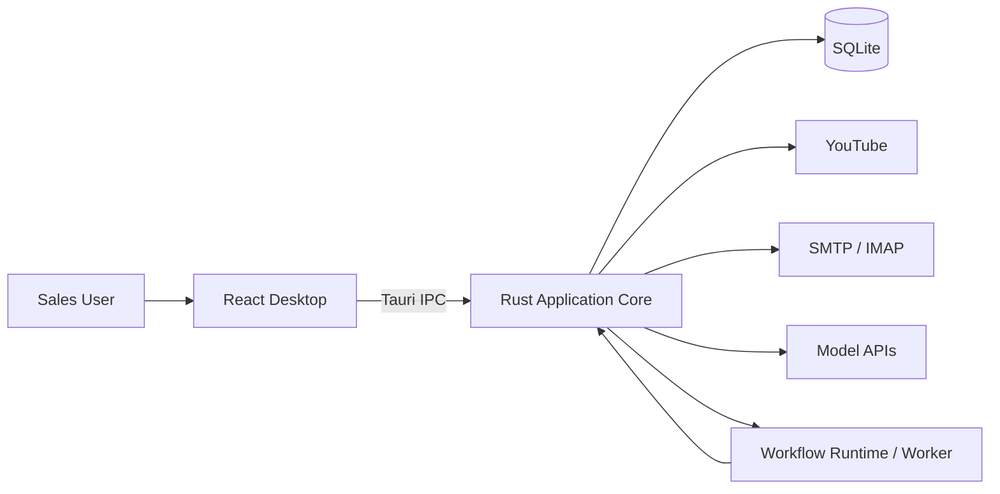

# OpenDesk 产品架构

## 定位

OpenDesk 是本地优先的 AI 商务桌面：YouTube 获客、SMTP/IMAP 邮件谈价、客户与报价留痕，以及人工确认的 AI 辅助。MVP 路线与验收以 [`mvp-sales-workbench.md`](../managed/roadmaps/mvp-sales-workbench.md) 为准。

## 系统架构


```mermaid
flowchart LR
  U[Sales User] --> R[React Desktop]
  R -->|Tauri IPC| C[Rust Application Core]
  C --> DB[(SQLite)]
  C --> YT[YouTube]
  C --> MAIL[SMTP / IMAP]
  C --> LLM[Model APIs]
  C --> JOB[Workflow Runtime / Worker]
  JOB --> C
```

Rust 是唯一协调者与运行时。`crates/agent` 提供 AI 基建（`llm/`、`prompt/`、`skills/`）；业务 Prompt、权限与客户上下文由调用 Feature 负责。

## 主要能力

- Crawler：YouTube 频道、邮箱与来源元数据；可由 Worker 补全无邮箱结果。
- Customer：客户档案、报价、合作状态和时间线。
- Mail：模板、SMTP 发送、IMAP 增量同步/IDLE、未匹配入站关联。
- Agent/LLM：Provider 配置、Rust 直连模型、邮件/关键词等 AI 辅助。
- Workflow/Worker：多步骤可恢复工作流与后台轮询任务。

## 产品边界

- 邮件、渠道发送与客户状态修改需要明确的人工操作。
- AI 读取必要上下文并生成草稿/建议，不直接执行高权限业务写操作。
- 凭据存系统安全存储，不进入普通日志或 Contract 响应。
- React 只显示和发起意图，所有业务校验与副作用由 Rust 完成。

## Contract

Rust 与 React 的共享类型来自 `contracts/`：

```text
Contract → pnpm contracts:sync → Rust → React
```

## 当前事实

仓库已有 Rust LLM 客户端、客户与邮件垂直切片、IMAP 同步/IDLE、YouTube Crawler、独立 Worker 与 Workflow Runtime。未完成能力以当前 Domain/Change Record 为准，不在本架构文档复制计划状态。
