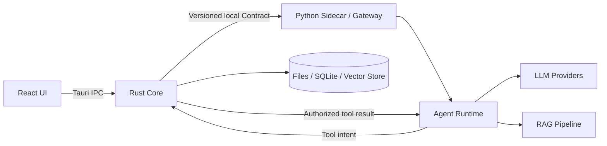
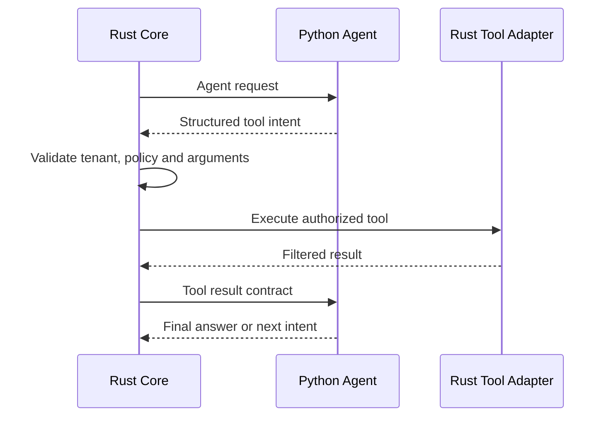

# Python AI Runtime 工程架构

## 1. 文档定位

本文描述 OpenDesk Python AI Runtime 的**目标工程架构**，以当前 uv workspace 为基础，支撑 **商务工作台 MVP**：邮件 AI 起草、WhatsApp 翻译/回复建议、**只读**客户与价目表查询。

> 当前 Python 端仅具备 sidecar、gateway Ping、共享日志和若干 package 骨架。邮件起草、只读 Query 工具、WA 翻译/建议等均为 **待规划能力**。

## 2. 运行时定位

Python AI Runtime 是 Desktop Agent 的 AI 计算层，负责：

- 邮件谈价/跟进 **草稿** 生成（`mail_draft`）；
- WhatsApp 消息 **翻译**（`wa_translate`）与 **回复建议**（`wa_suggest`）；
- LLM Provider 调用；
- Prompt 组装（注入 Rust 提供的客户档案与价目表摘要）；
- **只读** ToolCall 发起（实际查询由 Rust Query Port 执行，见 ADR-0001）。

Python 不负责：

- React UI 或 Tauri 事件；
- WhatsApp / SMTP **发送**（发送由 Rust 经 UI 人工触发）；
- 本地文件管理、SQLite 或向量数据库 **读写**；
- 客户报价/合作状态的 **修改**；
- sidecar 进程生命周期。

这些能力由 Rust Application Core 统一协调。

## 3. 核心边界



硬约束：

1. React 不直接调用 Python。
2. Python 不直接访问本地文件、SQLite 或向量数据库。
3. Python 不直接接收或发送 WhatsApp 消息。
4. Tool Calling 由 Python 决策、Rust 授权和执行。
5. 跨端 DTO 必须来自 `contracts/` 的生成物。
6. Python package 之间通过明确接口协作，避免形成共享状态大包。

## 4. 工程结构

后续实现应沿用仓库现有 uv workspace，不创建与其平行的单体 `python/main.py` 结构：

```text
python/
├── sidecar/
│   └── sidecar/
│       ├── main.py                 # 进程入口
│       ├── server.py               # 本机协议适配
│       ├── routes.py               # 生成或校验后的路由绑定
│       └── logging_config.py
└── packages/
    ├── contracts/                  # Python 生成契约
    ├── shared/                     # 日志、上下文等通用基础
    ├── gateway/                    # Rust → Python 入站用例适配
    ├── queue/                      # AI 任务队列抽象
    ├── worker/                     # 后台任务执行
    ├── provider/                   # Provider 注册、路由和策略
    ├── llm/                        # 统一 LLM 接口及实现
    ├── agent/                      # Agent executor / planner
    ├── rag/                        # 切片、Embedding、Retriever
    ├── prompt/                     # Prompt 模板、版本和渲染
    ├── memory/                     # 会话记忆抽象
    ├── model/                      # 模型配置与能力描述
    ├── workflow/                   # AI 工作流编排
    ├── ocr/                        # 文档 OCR
    └── browser/                    # 受控浏览器能力
```

WhatsApp 渠道适配属于 Rust Channel Feature，不在 Python 下新增 `whatsapp/` 网络客户端。Python 只处理 Rust 传入的标准化会话消息。

## 5. 模块职责

### 5.1 Sidecar

职责：

- 解析启动参数并监听 loopback；
- 暴露由 Contract 定义的本机 API；
- 将请求分发到 gateway；
- 输出结构化日志；
- 提供健康检查。

Sidecar 应保持薄层，不承载 Agent、RAG 或 Provider 业务实现。

### 5.2 Contracts

`python/packages/contracts` 是 `contracts/` 的 Python codegen 输出。

要求：

- gateway 的请求与响应必须显式使用生成类型；
- 运行时校验不能只依赖 `TypedDict` 静态提示；
- 复杂 Schema、枚举、数组、嵌套对象和 `$ref` 必须先完善 codegen；
- 禁止在 handler 中长期维护与 Contract 重复的裸 `dict[str, Any]`。

### 5.3 Gateway

Gateway 是 Rust 调用 Python 的应用入口：

- 校验 Contract；
- 建立 request/trace/tenant 上下文；
- 调用 Agent、RAG 或 Worker 用例；
- 将内部错误映射为契约化错误；
- 返回稳定 DTO。

未来候选能力包括聊天处理、知识检索、文档处理和 Agent 执行。具体 endpoint 名称与字段必须先在 `contracts/` 中批准，本文不直接定义运行时 API。

### 5.4 Queue 与 Worker

用于隔离长耗时任务：

- 文档解析与切片；
- Embedding；
- 批量知识库索引；
- 长耗时 Agent 工作流；
- 可取消任务。

任务状态通过 Contract 返回 Rust，由 Rust 持久化并通过 Tauri Event 通知 React。Python 不直接向 React 推送。

### 5.5 LLM 与 Provider

统一模型接口应覆盖：

- 对话生成；
- 流式输出；
- Tool Calling；
- Embedding；
- 超时、取消和 token 使用量；
- Provider 能力声明。

概念接口：

```python
from collections.abc import AsyncIterator
from typing import Protocol


class LLMProvider(Protocol):
    async def generate(self, request: "GenerateRequest") -> "GenerateResult":
        ...

    def stream(self, request: "GenerateRequest") -> AsyncIterator["GenerateChunk"]:
        ...
```

Provider 实现可包括 OpenAI、Claude、Gemini、本地模型和企业私有模型，但上层 Agent 不依赖具体厂商 SDK。

模型路由应考虑：

- 企业策略和数据敏感级别；
- 模型能力；
- 语言；
- 成本和延迟；
- 健康状态与降级顺序。

### 5.6 Agent

Agent 负责 AI 决策，不直接执行具有外部副作用的工具。

```text
Normalized Message
→ Policy Context
→ Intent / Risk Detection
→ Memory Context
→ RAG Retrieval
→ Tool Decision
→ LLM Generation
→ Reply / Tool Intent / Handoff Suggestion
```

输出必须是结构化结果，并至少表达：

- 回复候选；
- 置信度；
- 引用来源；
- 工具意图；
- 人工接管原因；
- 可观察的 token/latency 信息。

### 5.7 RAG

RAG 包含两个流程。

索引：

```text
Rust-authorized document bytes/reference
→ Parse / OCR
→ Normalize
→ Chunk
→ Embedding
→ Return index records to Rust Storage Port
```

查询：

```text
Query + authorized scope
→ Query embedding
→ Rust Vector Query Port
→ Retrieved chunks
→ Rerank
→ Context with citations
```

Python 可以计算向量和排序，但数据持久化与租户过滤由 Rust 控制。

### 5.8 Prompt

Prompt 必须独立于业务代码管理，例如：

```text
python/packages/prompt/
├── src/prompt/
│   ├── templates/
│   │   ├── customer-service.md
│   │   ├── order-agent.md
│   │   └── sales-agent.md
│   ├── registry.py
│   ├── renderer.py
│   └── version.py
└── tests/
```

要求：

- Prompt 有稳定 ID 和版本；
- 模板变量经过校验；
- 系统规则与用户内容明确分隔；
- 关键 Prompt 变更有评测结果；
- 禁止在 Provider 或 handler 中散落大段硬编码 Prompt。

### 5.9 Memory

Memory 负责定义会话上下文选择和摘要策略，不直接查询 SQLite。

Rust 按权限读取消息或摘要，通过 Contract 提供给 Python；Python 返回新的摘要建议，再由 Rust 决定是否持久化。

### 5.10 Tool Calling

工具流程：



Python 工具定义只描述名称、参数 Schema、用途和风险等级；凭据、网络调用、重试、幂等和审计由 Rust Adapter 负责。

## 6. Rust ↔ Python 通信

### 6.1 原则

- sidecar 只监听 `127.0.0.1`；
- Rust 负责端口、进程、健康检查和重启；
- 请求包含 schema version、request ID、trace ID 与 tenant context；
- 错误使用稳定 code，不把 Python traceback 直接暴露给 React；
- 大文件优先使用 Rust 管理的临时资源句柄或受控流，避免无限制 JSON body；
- 流式输出经 Python → Rust → Tauri Event → React。

### 6.2 概念请求与响应

以下仅说明信息结构，不是已批准 Contract：

```json
{
  "schema_version": "v1",
  "request_id": "req_123",
  "trace_id": "trace_123",
  "conversation_id": "conv_123",
  "message": "我的订单在哪里？",
  "locale": "zh-CN",
  "policy": {
    "allowed_tools": ["order.query"],
    "model_route": "enterprise-default"
  }
}
```

```json
{
  "schema_version": "v1",
  "request_id": "req_123",
  "outcome": "tool_required",
  "reply": null,
  "tool_intents": [
    {
      "name": "order.query",
      "arguments": {
        "order_id": "provided-by-customer"
      }
    }
  ],
  "handoff": null
}
```

正式实现前必须在 `contracts/schema/` 或 OpenAPI 中定义对应契约并执行 codegen。

## 7. AI 客服处理流程

```text
Request validation
→ Input normalization
→ Policy and risk check
→ Intent detection
→ Memory selection
→ RAG retrieval
→ Tool decision
→ Model generation
→ Output validation
→ Confidence and handoff decision
→ Contract response
```

每个阶段必须支持超时、取消和结构化日志，并避免把完整敏感内容写入日志。

## 8. 错误与降级

### 8.1 错误分类

- `invalid_request`：契约或字段错误；
- `policy_denied`：权限或策略拒绝；
- `provider_unavailable`：模型不可用；
- `provider_rate_limited`：模型限流；
- `retrieval_failed`：检索失败；
- `tool_required`：等待 Rust 执行工具；
- `tool_failed`：工具结果失败；
- `timeout`：任务超时；
- `internal_error`：未分类内部错误。

### 8.2 降级顺序

1. 在幂等和预算允许时进行有限重试；
2. 按企业策略切换模型 Provider；
3. 降级为仅检索或模板回复；
4. 返回明确的人工接管建议。

禁止无上限重试，也禁止在失败时伪造订单、物流或政策答案。

### 8.3 可观察性

日志至少包含：

- request ID；
- trace ID；
- task ID；
- feature；
- provider/model；
- latency；
- token usage；
- error code。

Token、API key、手机号、邮箱、完整 Prompt 和原始客户敏感信息必须脱敏或省略。

## 9. 测试策略

### 9.1 单元测试

- Prompt 渲染和变量校验；
- 意图与输出解析；
- Provider 错误映射；
- Chunking、rerank 和上下文预算；
- Tool intent Schema；
- 脱敏和日志上下文。

### 9.2 Contract 测试

- 生成物与源 Schema 无漂移；
- gateway 请求、响应和错误满足契约；
- Rust 与 Python 对相同 fixture 的序列化结果一致。

### 9.3 集成测试

- Rust 启动 sidecar 并完成健康检查；
- Agent 请求与工具往返；
- Provider Mock 的成功、超时和限流；
- 文档索引与检索；
- sidecar 重启后的任务恢复或明确失败。

### 9.4 AI 评测

- FAQ 正确率和引用准确率；
- 幻觉率；
- 工具选择和参数准确率；
- 人工接管召回率；
- 多语言质量；
- 延迟和 token 成本。

## 10. 开发原则

- **单一职责**：sidecar、gateway、agent、rag、provider 各自保持清晰边界；
- **依赖倒置**：上层用例依赖 Protocol/Port，不依赖具体 SDK；
- **Contract First**：跨 Rust/Python 字段先改 Contract；
- **可替换**：支持云、本地和企业私有模型；
- **可观测**：所有调用可通过 trace ID 关联；
- **最小数据**：只向模型和工具提供当前任务必需的数据；
- **无隐藏副作用**：Python 不绕过 Rust 写文件、数据库或企业系统。

## 11. 交付阶段

### 阶段 0：运行时基线

- sidecar 生命周期；
- Ping Contract；
- 结构化日志；
- 生产冻结和桌面打包。

### 阶段 1：商务 AI MVP

- 生成请求/响应 Contract（mail_draft、wa_translate、wa_suggest）；
- 单一 Provider 抽象与实现；
- **只读** Query 工具往返（customer.* / pricing.* / quote.history）；
- `context_loader`：生成前强制拉取客户档案 + 价目表；
- Mock 与跨进程集成测试。

> 阶段 1 **不包含**：AI 写库、自动发邮件/WA、完整 RAG 知识库平台。

### 阶段 2：增强能力

- RAG 质量与引用；
- Tool Calling 往返；
- 多语言；
- 模型路由和降级；
- AI 自动评测。

### 阶段 3：企业能力

- 私有模型；
- 多租户策略；
- 并发队列与资源配额；
- 可审计 Prompt 和模型治理。

## 12. 相关文档

- [`product-architecture.md`](product-architecture.md) — 商务工作台产品架构；
- [`../managed/MVP_REVIEW.md`](../managed/MVP_REVIEW.md) — GitHub 团队评审入口；
- [`../managed/decisions/customer/adr-0001-ai-readonly-query-port.md`](../managed/decisions/customer/adr-0001-ai-readonly-query-port.md) — AI 只读查库；
- [`contracts/README.md`](../../contracts/README.md) — 契约唯一真相源与 codegen；
- [`skills/opendesk/guides/python.md`](../../skills/opendesk/guides/python.md) — Python 端开发规范；
- [`skills/opendesk/guides/rust-python-ipc.md`](../../skills/opendesk/guides/rust-python-ipc.md) — Rust 与 Python 通信规范。
