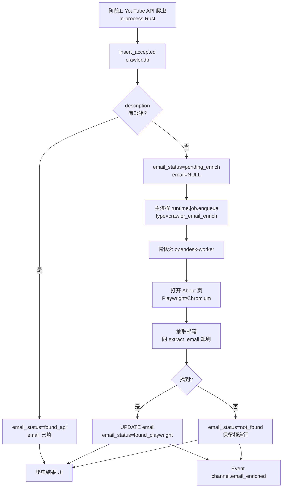

# 爬虫 Playwright 邮箱补全（两阶段，不丢弃）

## 目标

YouTube 爬虫采用 **两阶段邮箱获取**，**永不因无邮箱而丢弃频道结果**：

1. **阶段 1（已有）**：YouTube Data API 从频道 `description` 抽取邮箱（`extract_email`）。
2. **阶段 2（本 Change）**：对 `email` 为空的 accepted 频道，主进程自动入队；`opendesk-worker` 用 **无头浏览器（Playwright / Chromium）** 打开频道 **About 页** 再尝试抽取邮箱，回写 `crawler.db`。

完成后可观察到的结果：

- 爬虫结果列表始终保留所有通过筛选的频道（含无邮箱行）。
- 无邮箱行显示 `email_status=pending_enrich` → `enriching` → `found_playwright` 或 `not_found`。
- Playwright 补到邮箱后，该行可导入客户（CHG-014）；`not_found` 行仍保留，可手动补邮箱或重试。
- UI 主进程无浏览器 CPU 峰值；补全任务在 Worker 执行。

## 非目标

- 改造阶段 1 的 YouTube API 搜索/筛选逻辑（国家排除、`min_year_video_count` 等不变）。
- 无邮箱频道 **自动丢弃** 或 **自动导入客户**。
- Python Sidecar 跑 Playwright。
- 主进程内启动 Chromium / Playwright。
- 非 YouTube 平台。
- 爬取 About 页以外的链接（社媒外链、网站 WHOIS 等）— 后续独立 Change。
- 将阶段 1 API 爬虫整体迁入 Worker（仍为 in-process，见 ADR-0002 §5）。

## 背景

MVP 获客主路径要求邮箱进入客户档案，但不少创作者把邮箱放在 YouTube **About 页的「查看电子邮件地址」** 后，YouTube Data API 的 `snippet.description` **不一定包含**。

当前实现（`crates/crawler/src/lib.rs`）仅在 description 上做 best-effort 抽取；无邮箱时 `email=None` 但仍 `insert_accepted`。CHG-014 规定无邮箱不可导入，但未定义补全路径。

用户确认策略：

- API 先拿；
- 无邮箱再开 Playwright 补；
- **不丢弃** 频道记录。

Playwright 属于重 IO/CPU 任务，必须在 `opendesk-worker` 执行（ADR-0002）。

## 影响与边界

### 修改范围

| 层级 | 路径 | 改动内容 |
|------|------|----------|
| Contract | `contracts/schema/v1/crawler/dto/channel_result.schema.json` | 新增 `email_status`、`enrich_attempts`、`enrich_error`、`enriched_at` |
| Contract | `contracts/schema/v1/crawler/dto/email_status.schema.json`（新建） | 枚举定义 |
| Contract | `contracts/schema/v1/crawler/event/channel.email_enriched.schema.json`（新建） | 单频道补全完成事件 |
| Contract | `contracts/schema/v1/runtime/dto/background_job.schema.json` | `job_type` 增加 `crawler_email_enrich` |
| Storage | `crawler.db` migration `add_email_enrich_status` | 见 §数据库增量 |
| Storage | `crates/storage/src/crawler_db/models.rs` | 新字段 + `update_email_enrich` |
| Storage | `crates/ports/src/crawler_channels.rs` | `ChannelRecord` 扩展；`update_email` trait 方法 |
| Rust | `crates/crawler/src/lib.rs` | 插入时设 `email_status`；无邮箱时 `runtime.enqueue` |
| Rust | `crates/crawler/src/app/enqueue_email_enrich.rs`（新建） | 构建 payload、去重入队 |
| Crate | `crates/crawler-enrich/`（新建，**仅 worker 依赖**） | Playwright/Chromium About 页抓取 + 邮箱抽取 |
| Worker | `crates/worker/src/handlers/crawler_email_enrich.rs`（新建） | claim job → 读 crawler.db → enrich → 回写 |
| Runtime | `crates/runtime/` 或 `crates/app/` | Worker 打开 `crawler.db` 路径（与主进程共享 data dir） |
| Frontend | `apps/desktop/src/features/crawler/crawler-page.tsx` | 邮箱状态列、补全中/失败/重试 UI |
| Frontend | `apps/desktop/src/features/crawler/use-crawler-job.ts` | 订阅 `channel.email_enriched` Event |
| Frontend | `apps/desktop/src/i18n/locales/crawler/` | `emailStatus.*` 文案 |
| Docs | `docs/architecture/database-schema.md` §6 | 同步 DDL |
| Docs | `docs/managed/domains/crawler/README.md` | 两阶段策略 |
| Docs | `docs/architecture/process-model.md` | Worker 补全邮箱时序（可选一节） |

### 不修改范围

| 路径 | 原因 |
|------|------|
| `python/**` | 补全纯 Rust Worker |
| `crates/app` → `crawler-enrich` | ADR-0002：主进程不得链接浏览器引擎 |
| YouTube Data API 调用逻辑 | 阶段 1 不变 |
| `crates/customer/**` | 导入仍在 CHG-014；本 Change 只回写 crawler 邮箱 |
| CHG-014 导入 IPC 语义 | 仍要求 `email` 非空；补全后自然满足 |

### Contract

- 扩展 `channel_result` DTO 与 `background_job.job_type`。
- 新增 `channel.email_enriched` Event（可选 `job.progress` 复用 runtime 通用事件）。

### 跨层

- React 轮询/Event 刷新 crawler 结果；不入队 Playwright。
- 主进程：API 爬虫写 `crawler.db` + `INSERT background_job`。
- Worker：读 `crawler.db` + 写 `crawler.db` + 更新 `opendesk.db.background_job`。

### 跨 Feature

- Crawler → Runtime（`job.enqueue`）；不 direct 调 OCR Feature。
- Worker 同时访问 `crawler.db` 与 `opendesk.db`（双库；无跨库 FK）。

### 风险

| 风险 | 缓解 |
|------|------|
| YouTube 反爬 / ToS | 低并发（默认 1–2）、随机延迟 2–5s、User-Agent 标识 OpenDesk；失败可重试，不删记录 |
| Chromium 体积 | 首版可用系统 Chrome channel 或安装时可选组件；文档说明依赖 |
| 双库 Worker 写 crawler.db | WAL + 短事务；主进程读状态用轮询/Event |
| About 页 DOM 变更 | 选择器集中 `crawler-enrich` crate；失败记 `enrich_error` 便于修 |
| 重复入队 | `email_status=pending_enrich` 才入队；`enriching` 时拒绝重复 enqueue |

## 依赖关系

- 父任务：EPIC-20260720-001
- 前置：**CHG-023**（`opendesk-worker` + `background_job` 队列）
- 相关：CHG-014（导入规则不变）、现有 YouTube 爬虫垂直切片
- ADR：0002（Worker 执行浏览器任务）

**与 M1/M6 关系：** 里程碑归 **M1**（获客召回）；实施上 **依赖 M6 的 Worker 骨架（CHG-023）**，可与 CHG-014 并行开发接口，联调需 Worker 就绪。

## 设计方案

### 1. 两阶段总流程



### 2. `email_status` 状态机

| 状态 | 含义 | 可导入客户 |
|------|------|------------|
| `found_api` | 阶段 1 description 抽到 | 是（CHG-014） |
| `pending_enrich` | 已入库，等待 Worker | 否 |
| `enriching` | Worker 正在打开 About 页 | 否 |
| `found_playwright` | 阶段 2 补到邮箱 | 是 |
| `not_found` | 两阶段均未找到 | 否（保留行，可重试） |
| `enrich_failed` | 可恢复错误（超时、网络） | 否（可重试） |

转换：

```text
(found_api)           — 插入时 email 有值
pending_enrich        — 插入时 email 无值
pending_enrich → enriching → found_playwright | not_found | enrich_failed
enrich_failed → pending_enrich — 用户点击「重试补全」或定时重试（最多 N 次）
```

**不丢弃：** `not_found` / `enrich_failed` 频道行永久保留在 `crawler_channel`；仅 `email` 为空时禁用「导入为客户」。

### 3. About 页 URL 规则

按优先级构造（`crawler-enrich` 内）：

```text
1. https://www.youtube.com/{custom_url}/about     — custom_url 已含 @handle
2. https://www.youtube.com/channel/{channel_id}/about
```

抓取策略（MVP）：

1. 等待 About 区域加载（`networkidle` 或固定 selector 超时 15s）。
2. 若存在「查看电子邮件地址」/ `View email address` 按钮 → 点击 → 读 `mailto:` 或可见文本。
3. 否则对整页 `innerText` 跑与 `extract_email` 相同的 token 扫描（含 `[at]`/`[dot]` 归一化）。
4. 取 **第一个** 合法邮箱；多邮箱时记入 `enrich_error` 备注但不失败。

### 4. 任务队列与 payload

使用 `opendesk.db.background_job`（与 OCR 共用协调模型）：

```json
{
  "job_type": "crawler_email_enrich",
  "payload_json": {
    "crawler_job_id": "uuid",
    "channel_id": "UCxxxxxxxx",
    "platform": "youtube",
    "custom_url": "@SomeHandle",
    "title": "Channel Title",
    "attempt": 1
  }
}
```

入队时机：阶段 1 `insert_accepted` 成功后，若 `email.is_none()` → 调用 `enqueue_email_enrich`（同一事务外，失败记日志不阻断爬虫）。

去重：同一 `(crawler_job_id, channel_id)` 在 `queued|running` 状态下不重复入队。

### 5. Worker 处理器

```text
1. claim background_job (type=crawler_email_enrich)
2. UPDATE crawler_channel SET email_status=enriching WHERE job_id AND channel_id
3. crawler-enrich::fetch_email_about_page(url) → Option<String>
4. 若 Some(email): UPDATE email, email_status=found_playwright, enriched_at=now
   若 None:     UPDATE email_status=not_found
   若 Err:      UPDATE email_status=enrich_failed, enrich_error=..., enrich_attempts+=1
5. complete background_job
6. 主进程转发 Event channel.email_enriched → React 刷新行
```

**并发：** Worker 配置 `CRAWLER_ENRICH_MAX_CONCURRENT=1`（默认），避免同时开多个 Chromium。

**速率：** 任务间隔 `sleep(random 2000..5000ms)`。

### 6. 数据库增量（crawler.db）

```sql
-- Migration: add_email_enrich_status
ALTER TABLE crawler_channel ADD COLUMN email_status TEXT NOT NULL DEFAULT 'pending_enrich';
ALTER TABLE crawler_channel ADD COLUMN enrich_attempts INTEGER NOT NULL DEFAULT 0;
ALTER TABLE crawler_channel ADD COLUMN enrich_error TEXT;
ALTER TABLE crawler_channel ADD COLUMN enriched_at TEXT;

CREATE INDEX idx_crawler_channel_email_status
    ON crawler_channel(job_id, email_status);

-- 回填：已有行按 email 是否为空设置状态
UPDATE crawler_channel SET email_status = 'found_api' WHERE email IS NOT NULL AND email != '';
UPDATE crawler_channel SET email_status = 'pending_enrich' WHERE email IS NULL OR email = '';
```

`background_job.job_type` 在 `opendesk.db` 侧增加枚举值 `crawler_email_enrich`（见 `database-schema.md`）。

### 7. 浏览器运行时选型

实施时 **二选一**（本 Change 验收前在 PR 描述中记录）：

| 方案 | 说明 |
|------|------|
| **A · chromiumoxide**（推荐） | 纯 Rust CDP；Worker 链接 `crawler-enrich`；需用户本机 Chrome/Chromium 或安装包捆绑 `chromium` 组件 |
| **B · Playwright CLI 子进程** | Worker `Command::new("playwright")`；依赖 Node 运行时，打包更重 |

**硬约束：** `crates/app` / Tauri 主 crate **不得** depend on `crawler-enrich`。

### 8. UI 行为

| `email_status` | 列表展示 | 操作 |
|----------------|----------|------|
| `found_api` / `found_playwright` | 显示邮箱 | 「导入为客户」可用（CHG-014） |
| `pending_enrich` | 「补全排队中…」 | 导入禁用 |
| `enriching` | Spinner「正在获取邮箱…」 | 导入禁用 |
| `not_found` | 「暂未找到邮箱」 | 导入禁用；**「重试补全」** |
| `enrich_failed` | 错误摘要 | **「重试补全」** |

筛选器（可选 MVP）：全部 / 仅有邮箱 / 待补全 / 未找到。

### 9. 与 CHG-014 的衔接

- CHG-014 **不修改**：导入仍要求 `email` 非空。
- 本 Change 回写 `email` 后，前端 Event 刷新，导入按钮自动启用。
- `not_found` 行保留，销售可记笔记或未来手动填邮箱（非本 Change）。

## 实施方案

1. Contract：扩展 `channel_result` + `email_status` 枚举 + `crawler_email_enrich` job_type。
2. Migration：`crawler.db` 四字段 + 回填；`database-schema.md` 同步。
3. 阶段 1：`youtube_channel_record` 插入时设 `email_status`；无邮箱则 `enqueue_email_enrich`。
4. 新建 `crates/crawler-enrich`：About URL 构建、页面加载、按钮点击、邮箱抽取（复用/共享 `extract_email` 逻辑到 `crates/crawler` 或 `common`）。
5. Worker handler 注册 `crawler_email_enrich`；双库路径从 `data_dir` 配置读取。
6. Event + 爬虫页状态列与重试按钮。
7. 架构检查：`crates/app` 不依赖 `crawler-enrich`；`check_architecture.py` 规则追加。

## 验收

- [ ] API 爬虫：description 有邮箱 → `email_status=found_api`，**不入队** enrich
- [ ] API 爬虫：无邮箱 → 行仍出现在结果列表，`email_status=pending_enrich`，自动入队
- [ ] Worker：对测试频道 About 页可补全邮箱（提供 fixture channel_id 或 mock HTML）
- [ ] 补全成功 → `found_playwright`，UI 显示邮箱，导入按钮可点（与 CHG-014 联调）
- [ ] 补全失败 → `not_found` 或 `enrich_failed`，**频道行仍在**，不删除
- [ ] 「重试补全」可再次入队，`enrich_attempts` 递增
- [ ] UI 主进程无 Chromium 进程、无显著 CPU 峰值
- [ ] `crates/app` 不链接 `crawler-enrich`
- [ ] `pnpm lint` 与 `check_architecture.py` 通过

## 实际结果

（完成前留空。）

## 后续项

- 手动为 `not_found` 频道填写邮箱（Customer 预填或 crawler 行内编辑）— 新 Change
- About 页外扩：网站联系页、Linktree 等 — 新 Change
- 阶段 1 API 爬虫迁 Worker — 独立 Change（非 MVP 必须）
