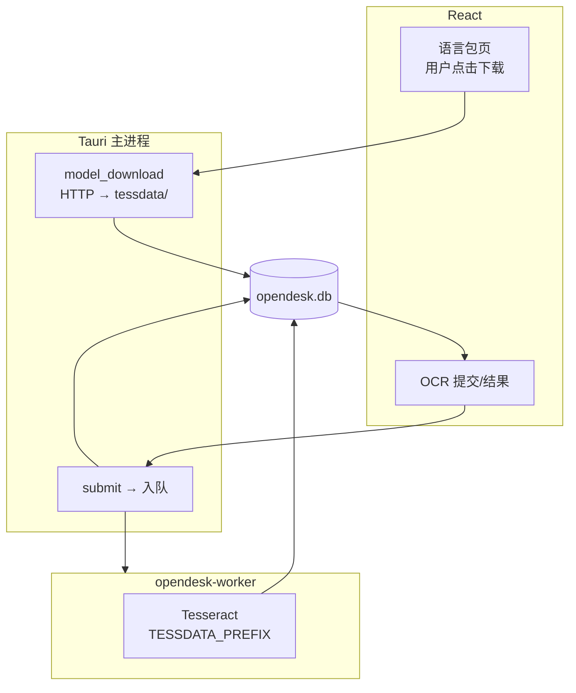

# OCR Domain

## 职责

对图片、PDF、扫描件等做 **本地文字识别**（**Tesseract**），结果结构化存入 `opendesk.db`。

- **语言包管理**：展示可下载 tessdata 列表；用户 **点击下载/删除**（不随安装包分发）
- 提交 OCR 任务（须已安装所需 `language_codes`；关联可选 `customer_id`）
- 分页、文本块、置信度、bbox 存储
- 进度与完成事件通知 UI
- 写入客户时间线 `ocr_completed`（可选）
- **商务场景**（见 [CHG-028](../../changes/2026/07/chg-20260720-028-ocr-business-scenarios.md)）

## MVP 商务场景（CHG-028）

| 场景 ID | 典型输入 | 用户价值 | 关联 |
|---------|----------|----------|------|
| `biz_card` | 名片照片 | 抽取邮箱/电话，预填客户表单 | Customer 新建/编辑 |
| `contract_snippet` | 合同/报价单截图 | 全文存档，供复盘与 AI 引用 | customer_id + timeline |
| `email_screenshot` | 客户邮件截图 | 辅助录入入站回复（可预填 CHG-026） | Mail + Customer |
| `price_list_image` | 价目表图片 | 识别文本，供人对照录入 Pricing | Pricing（人维护） |

AI 通过只读工具 `ocr.get_text` 获取已绑定客户的识别文本（CHG-017 扩展），**不自动改库**。

## 非职责

- 在 **Tauri UI 主进程** 内运行 Tesseract（**禁止**，见 ADR-0002）
- **安装时** 捆绑或静默下载 tessdata（见 ADR-0003）
- 云端 OCR API
- Python 直连 SQLite 或 Tesseract
- AI 对 OCR 结果的推理（Agent 领域；主进程传入文本片段）

## 稳定边界

```text
React（OCR 页 + 语言包下载页）
  → ocr.model.list / download / delete     （主进程 HTTP 下载 → tessdata/）
  → ocr.submit / get_result / cancel       （主进程入队）
  → opendesk-worker（Tesseract + 已安装 tessdata → 写 ocr_* 表）
  → Event → React 刷新
```



**tessdata 路径：** `{data_local}/OpenDesk/tessdata/*.traineddata`

## 入口

| 类型 | 路径（规划） |
|------|--------------|
| Rust Feature | `crates/ocr/` |
| OCR 引擎 | `crates/ocr-engine/`（**仅 Worker 依赖**，Tesseract 绑定） |
| Worker | `crates/worker/src/handlers/ocr.rs` |
| Contract | `contracts/schema/v1/ocr/` |
| React | `apps/desktop/src/features/ocr/` |
| DB | [database-schema.md §5.5](../../../architecture/database-schema.md) |
| ADR | [ADR-0002 Worker](../../decisions/runtime/adr-0002-heavy-work-worker-process.md) · [ADR-0003 Tesseract 本地下载](../../decisions/ocr/adr-0003-tesseract-local-model-on-demand-download.md) |
| Change | [CHG-025 语言包下载](../../changes/2026/07/chg-20260720-025-ocr-tesseract-model-download.md) · [CHG-024 识别管线](../../changes/2026/07/chg-20260720-024-ocr-worker-pipeline.md) · [CHG-028 商务场景](../../changes/2026/07/chg-20260720-028-ocr-business-scenarios.md) |

## 数据模型（摘要）

| 表 | 用途 |
|----|------|
| `ocr_language_pack` | 可选语言目录 + 用户安装状态（**非**安装包预装） |
| `background_job` | 队列；`job_type=ocr` |
| `ocr_job` | 源文件、`language_codes`、状态 |
| `ocr_document` / `ocr_page` / `ocr_text_block` | 识别结果 |

## 进程与模型硬约束

| 允许 | 禁止 |
|------|------|
| Worker 内 Tesseract 识别 | 主进程链接 `ocr-engine` |
| 主进程 **用户触发** 下载 tessdata | 安装包内置 traineddata |
| 主进程读已完成 `ocr_text_block` | 启动时自动下载语言包 |
| 主进程校验语言包已安装再入队 | 未安装语言时静默 OCR |

## 当前状态

**未实现。** `crates/ocr`、`python/packages/ocr` 为骨架；引擎与下载均未做。

## 当前约束

- 引擎 **固定 Tesseract**（ADR-0003）
- 首版即 Worker 进程（ADR-0002）
- 用户须先下载语言包再提交 OCR
- 源文件路径须主进程白名单校验
