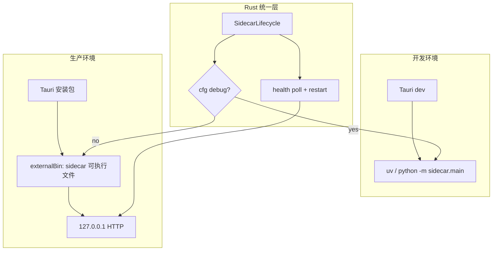

| Field | Value |
|-------|-------|
| ID | T018 |
| Priority | P0 |
| Status | completed |
| Depends on | T004 |
| Blocks | — |
| Milestone | M6 |

## Goal

定义并实现 **生产环境** 下 Rust 自带 Python Sidecar 的打包方案，使用户安装后 **无需本机 Python / uv**，桌面应用可自动拉起 sidecar 并完成业务 HTTP 通讯。覆盖 **Windows** 与 **macOS** 双平台（含现有 CI 四类 target）。

## 背景（现状）

| 项 | 现状 |
|----|------|
| 通讯 | Rust `SidecarClient` → `http://127.0.0.1:{port}` |
| 拉起 | `tokio::process::Command` spawn 子进程 |
| 开发 | 优先 `uv run -m sidecar.main`，回退系统 `python` |
| Tauri bundle | 仅 React + Rust，**不含** Python 运行时 |
| 路径 | `resolve_sidecar_dir()` 向上查找 `python/sidecar` 或 `OPENDESK_SIDECAR_DIR` |
| CI | `.github/workflows/release-desktop.yml` 已有 Win x64/x86 + macOS Intel/ARM 四套 `pnpm tauri build` |
| 缺口 | T004 Out of scope：**打包后 sidecar 路径探测**（仍未实现） |

## 推荐方案（总览）

采用 **「冻结 Sidecar 可执行文件 + Tauri externalBin」**，开发/生产双路径：



**为何不用「要求用户装 Python」：** 企业桌面分发不可控，违背一键安装预期。

**为何不用 PyO3 内嵌：** 与现有 Sidecar HTTP 架构、六边形边界、独立进程隔离（崩溃/重启）冲突；改动面过大。

**为何选 PyInstaller（首选）而非嵌入式 CPython + venv：**

| 方案 | 体积 | 复杂度 | 与现有 spawn 模型契合 |
|------|------|--------|----------------------|
| PyInstaller 冻结 sidecar | 中（~80–150MB/平台） | 低 | 高 — 单个可执行文件 + `--port` |
| python-build-standalone + vendor venv | 大 | 高（路径、ABI、升级） | 中 |
| 继续依赖系统 Python | 小 | 最低 | 低 — 非生产可用 |

备选：若 PyInstaller 误报/体积过高，可退到 **Nuitka standalone** 或 **uv 导出固定解释器 + site-packages**（Phase 2 评估）。

---

## 安装包目录结构（目标）

### Windows（MSI / NSIS）

```
%ProgramFiles%\OpenDesk\
├── OpenDesk.exe                 # Tauri 主程序
└── sidecar-x86_64-pc-windows-msvc.exe   # externalBin（与主程序同目录）
```

x86 构建同理：`sidecar-i686-pc-windows-msvc.exe`。

### macOS（.app / .dmg）

```
OpenDesk.app/
└── Contents/
    ├── MacOS/
    │   ├── OpenDesk
    │   └── sidecar-aarch64-apple-darwin    # 或 x86_64 / universal
    └── Resources/
        └── ...（前端静态资源）
```

---

## 构建流水线（新增步骤）

在现有 `beforeBuildCommand: pnpm build` **之前** 增加 sidecar 冻结（各平台本地/CI 执行）：

```
1. uv sync（python workspace，锁定依赖）
2. pyinstaller 打包 python/sidecar → dist/sidecar-<target-triple>[.exe]
3. 复制到 apps/desktop/src-tauri/binaries/sidecar-<target-triple>[.exe]
4. pnpm build（前端）
5. pnpm tauri build --target <triple>
```

建议新增脚本（实现阶段）：

| 脚本 | 职责 |
|------|------|
| `tooling/scripts/build-sidecar.mjs` | 跨平台入口，读 `CARGO_BUILD_TARGET` / `--target` |
| `python/sidecar/sidecar.spec`（或 pyproject 内 hook） | PyInstaller 配置：入口 `sidecar.main`、隐式导入 gateway 依赖 |
| `apps/desktop/src-tauri/binaries/.gitkeep` | 占位；**产物不进 git**，CI 构建生成 |

**Tauri 配置变更（实现阶段）：**

```json
{
  "bundle": {
    "externalBin": [
      "binaries/sidecar"
    ]
  }
}
```

Tauri 按 target triple 自动解析 `binaries/sidecar-x86_64-pc-windows-msvc.exe` 等文件名。

---

## Rust 运行时变更（实现阶段）

`crates/runtime/src/sidecar/lifecycle.rs`：

1. 新增 `resolve_sidecar_launcher(app_handle?) -> SidecarLaunchSpec`：
   - **debug**：保持现有 `uv` / `python -m sidecar.main` 逻辑（开发者体验不变）
   - **release**：通过 `tauri::Manager::path().resource_dir()` 或 `tauri::utils::platform::current_exe` 旁路定位 `sidecar-<triple>`；`OPENDESK_SIDECAR_BIN` 可覆盖（运维/调试）
2. `build_spawn_command` 分支：
   - release → `Command::new(sidecar_bin).arg("--port").arg(port)`（**不再** `current_dir` 到源码树）
3. 废弃 release 下对 `OPENDESK_USE_UV` 的依赖（默认关闭或忽略）
4. 单元测试：launcher 解析逻辑（可用临时目录模拟二进制路径）

`crates/app` 需在 `SidecarLifecycle::new` 时注入 `Option<AppHandle>` 或封装 `SidecarRuntimeContext`（仅 desktop  crate 提供 path API，runtime crate 保持可测试）。

---

## 平台细则

### Windows

| 项 | 说明 |
|----|------|
| CI target | `x86_64-pc-windows-msvc`、`i686-pc-windows-msvc`（已有） |
| Sidecar 构建 | `windows-latest` + Python 3.13 + `uv sync` + PyInstaller |
| 产物 | `.msi` 优先（workflow 已偏好 msi） |
| 代码签名 | **强烈建议** Authenticode 签名 `OpenDesk.exe` + `sidecar-*.exe` + MSI，减轻 SmartScreen / Defender 误报 |
| PyInstaller 注意 | 优先 `--onedir` 或 onefile + 签名；排除不必要 ML 大包；在 `spec` 中显式 `collect_submodules` gateway 依赖 |
| 运行权限 | 默认用户权限；sidecar 仅监听 `127.0.0.1`，无需管理员 |
| 杀软 | 冻结 Python 易误报 → 签名 + 提交厂商白名单为发布 checklist |

**Windows 验证清单：**

- [ ] 干净 VM（无 Python）安装 MSI 后可启动
- [ ] 任务管理器可见 sidecar 子进程
- [ ] `agent_ping` E2E 通过
- [ ] 卸载后无残留进程

### macOS

| 项 | 说明 |
|----|------|
| CI target | `x86_64-apple-darwin`（macos-13）、`aarch64-apple-darwin`（macos-14）（已有） |
| Sidecar 构建 | 各 runner 本机架构编译；**不要**交叉编译 Python 扩展 |
| 产物 | `.dmg` 或 `.app`（workflow 已支持） |
| 签名 | Developer ID Application 签名 **主程序 + sidecar 二进制** |
| Hardened Runtime | `codesign --options runtime`；entitlements 允许本地网络（`com.apple.security.network.client` 等，按最小集） |
| 公证 | `notarytool submit` + `stapler staple`；**未公证无法在较新 macOS 上顺滑分发** |
| Universal Binary | **Phase 2 可选**：`lipo` 合并双架构 sidecar + Tauri universal app；首版可继续分架构发布（与现 CI 一致） |
| Gatekeeper | 用户下载后应显示已验证开发者 |

**macOS 验证清单：**

- [ ] 无 Python 的干净 macOS 安装 .dmg
- [ ] `spctl -a -vv` 验证通过（已公证）
- [ ] sidecar 监听 `127.0.0.1`（沙箱/防火墙不弹多余权限）
- [ ] Apple Silicon / Intel 各自包在对应机器可运行

---

## CI / Release 变更（`.github/workflows/release-desktop.yml`）

每个 build job 在 `pnpm tauri build` 前增加：

```yaml
- uses: actions/setup-python@v5
  with:
    python-version: "3.13"
- name: Install uv
  run: pip install uv
- name: Build frozen sidecar
  run: node tooling/scripts/build-sidecar.mjs --target ${{ matrix.target }}
```

macOS jobs 额外（需 secrets）：

```yaml
- name: Codesign + notarize
  env:
    APPLE_CERTIFICATE: ...
    APPLE_CERTIFICATE_PASSWORD: ...
    APPLE_SIGNING_IDENTITY: ...
    APPLE_ID: ...
    APPLE_PASSWORD: ...
    APPLE_TEAM_ID: ...
  run: # 签名 app bundle + sidecar + notarize
```

Windows jobs 可选：

```yaml
- name: Sign binaries
  env:
    AZURE_SIGNING_... # 或 signtool + 证书
```

更新 `verify-release-assets`：可选增加「smoke test」job（下载 artifact 跑 headless 健康检查）。

---

## 环境变量（生产 vs 开发）

| 变量 | 开发 | 生产 |
|------|------|------|
| `OPENDESK_USE_UV` | 默认 `1` | 忽略 / `0` |
| `OPENDESK_SIDECAR_DIR` | 指向源码 `python/sidecar` | 不需要 |
| `OPENDESK_PYTHON` | 可选 | 不需要 |
| `OPENDESK_SIDECAR_BIN` | 可选（测试冻结包） | 可选覆盖（运维） |
| `OPENDESK_SIDECAR_PORT` | 默认 `8787` | 同左 |

---

## 分阶段实施（建议拆 PR）

| 阶段 | 分支建议 | 交付 |
|------|----------|------|
| **P1** 方案 & 路径 API | `frontend/docs/sidecar-production-bundle`（本文档） | 计划评审通过 |
| **P2** Sidecar 冻结脚本 | `python/chore/sidecar-freeze` | PyInstaller spec + `build-sidecar` 本地可产出 |
| **P3** Rust launcher 双模式 | `frontend/feature/sidecar-bundle-launcher` | release 走 externalBin，debug 不变 |
| **P4** Tauri bundle 接线 | 同上 | `tauri.conf.json` externalBin + 本地 `tauri build` 验证 |
| **P5** CI 集成 | `frontend/chore/release-sidecar-ci` | 四套 target 流水线产出含 sidecar 的安装包 |
| **P6** 签名 & 公证 | `frontend/chore/release-signing` | Win 签名 + macOS 公证 checklist 完成 |

---

## Scope

- 本文档：Mac / Windows 生产打包方案、目录结构、CI 改造说明、验收标准
- 实现阶段（后续 PR）：P2–P6 代码与 workflow

## Out of scope

- Linux 桌面打包
- 在线更新 / delta 更新
- Sidecar 多实例 / 远程 sidecar
- 业务 Feature 本身的 AI 模型打包（仅 sidecar 运行时）

## Acceptance criteria

- [x] 方案评审：采用「冻结 sidecar + externalBin」路线
- [x] P2：`python/sidecar/sidecar.spec` + `tooling/scripts/build-sidecar.mjs`
- [x] P3：`lifecycle.rs` release 走 bundled executable，debug 仍用 uv / 源码
- [x] P4：`tauri.conf.json` `externalBin` + `build:bundle` 前置构建
- [x] P5：`release-desktop.yml` 四套 target 集成 sidecar 冻结（x86 job 使用 32-bit Python）
- [ ] P6：macOS 公证 + Windows 签名（延后）
- [ ] Windows x64 / x86、macOS Intel / ARM：无系统 Python 环境 E2E 验收（待发版验证）
- [x] 开发模式 `pnpm tauri dev` 行为不变（debug 不解析 bundled 路径）

## Key files

- `crates/runtime/src/sidecar/lifecycle.rs` — launcher / spawn
- `crates/app/src/lib.rs` — 注入 app path 上下文
- `apps/desktop/src-tauri/tauri.conf.json` — `externalBin` / resources
- `apps/desktop/src-tauri/binaries/` — 平台 sidecar 产物（构建生成）
- `python/sidecar/` — PyInstaller 入口与 spec
- `tooling/scripts/build-sidecar.mjs` — 构建编排
- `.github/workflows/release-desktop.yml` — CI 集成
- `skills/opendesk/guides/release.md` — 发布后补充 sidecar 打包章节

## Notes

- 当前分支：`frontend/docs/sidecar-production-bundle`（`pnpm branch:create frontend docs sidecar-production-bundle`）
- 跨 `python/**` 与 `crates/**` 实现需按分支规范拆 PR，或用户明确扩 scope 后在 `main` 集成分支一次性落地
- 体积优化（剔除未用 packages、UPX 等）放在首版可用之后的迭代
