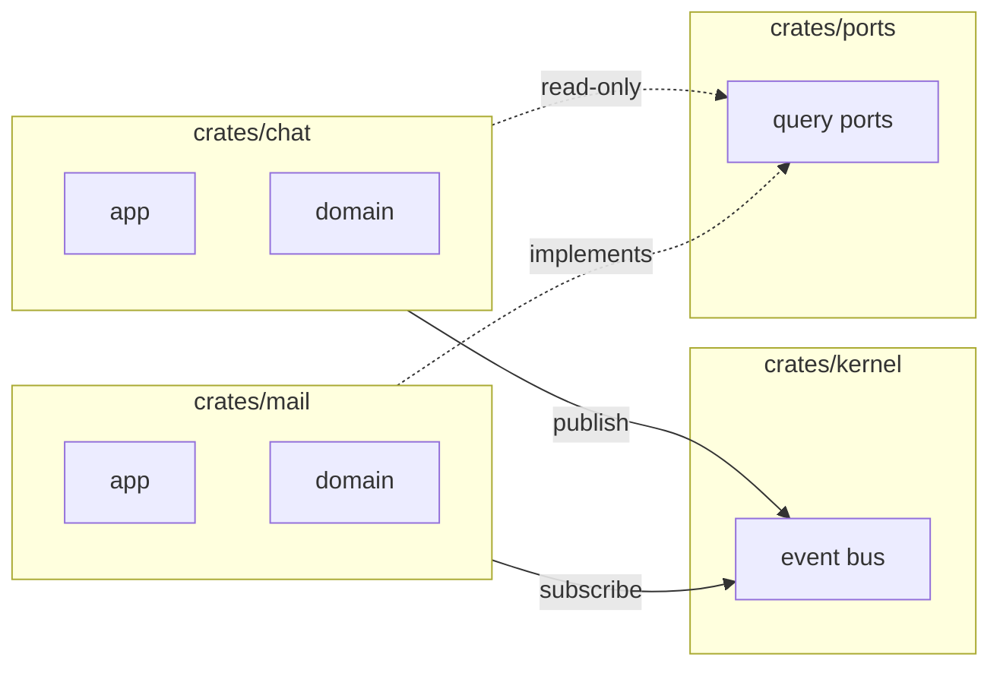

# Feature Boundary

Feature 是 OpenDesk 的最小业务垂直单元。每个 Feature 在 Rust、React、Contract 中拥有独立命名空间。

## Feature 列表

```
chat · mail · agent · workflow · knowledge · browser · ocr · mcp · plugin · tenant · user · channel
```

## 隔离模型



## 允许 vs 禁止

| ✅ 允许 | ❌ 禁止 |
|---------|---------|
| Feature → `kernel::event`（发布/订阅） | `use mail::` inside `chat` |
| Feature → `ports` trait（Query Port） | `chat` crate 依赖 `mail` crate |
| Feature → `contracts` DTO | Feature UI import 另一 Feature 内部模块 |
| Feature → `common` / `kernel` | 共享可变全局状态 |

## 每个 Feature 的标准结构

### Rust (`crates/<feature>/`)

```
crates/<feature>/
├── Cargo.toml
└── src/
    ├── lib.rs
    ├── app/          # UseCase / Application Service
    │   └── mod.rs
    └── domain/       # Entity / Value Object / Domain Error
        └── mod.rs
```

### React (`apps/desktop/src/features/<feature>/`)

```
features/<feature>/
├── index.ts          # Feature 注册（id、路由元数据）
├── pages/            # 页面组件
├── components/       # Feature 私有组件
└── hooks/            # Feature 私有 hooks（调 platform/ipc）
```

### Contract (`contracts/schema/v1/<feature>/`)

```
contracts/schema/v1/<feature>/
├── dto/              # 数据传输对象
├── ipc/              # Tauri 命令 DTO
├── event/            # 事件 payload
└── error/            # 错误码
```

## 跨 Feature 协作模式

### 模式 A：Event（写操作 / 状态变更）

```
chat 发布 MessageSent  →  kernel::event  →  knowledge 订阅索引
```

### 模式 B：Query Port（只读查询）

```rust
// crates/ports/src/chat_query.rs
pub trait ChatQueryPort: Send + Sync {
    fn thread_summary(&self, thread_id: &str) -> Result<ThreadSummary, PortError>;
}
```

### 模式 C：Contract（共享 DTO）

两端使用同一 JSON Schema 生成的类型，无运行时耦合。

## 新增 Feature

见 [../recipes/add-feature.md](../recipes/add-feature.md)。

## 相关文档

- [event.md](event.md)
- [../recipes/add-query-port.md](../recipes/add-query-port.md)
