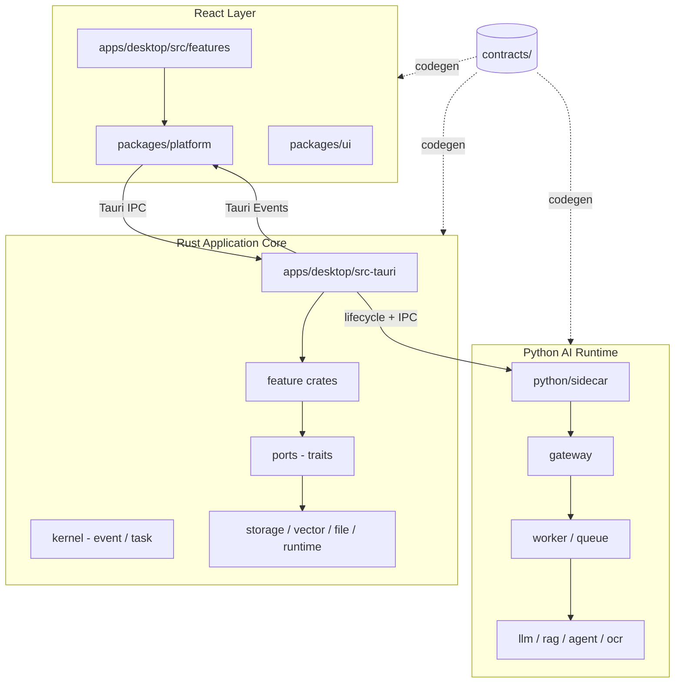

# Architecture Overview

OpenDesk 是企业级 AI 智能客服桌面平台，采用固定三层架构与契约驱动开发。

## 系统全景



## 技术栈

| 层 | 技术 |
|----|------|
| 桌面壳 | Tauri 2 |
| 前端 | React · TypeScript · Vite · pnpm workspace |
| 核心 | Rust Workspace · SQLite（经 storage 抽象） |
| AI | Python · sidecar · gateway · queue · worker |
| 契约 | JSON Schema · OpenAPI · codegen |

## 当前阶段

**Architecture Skeleton** — 允许目录、crate、trait、DTO、Contract、Interface、Mock；禁止业务逻辑与 Demo。

## 关键目录

| 路径 | 职责 |
|------|------|
| `apps/desktop` | Tauri + React 桌面应用 |
| `packages/ui` | 纯 UI 组件（无 IPC/业务） |
| `packages/platform` | IPC · OS API · 窗口 |
| `packages/contracts` | 前端契约类型（codegen） |
| `crates/` | Rust 业务与基础设施 |
| `python/` | AI Runtime |
| `contracts/` | 三端共享契约（唯一真相源） |

## 数据流（流式 AI 输出）

```
Python sidecar  →  Rust（聚合/鉴权/日志）  →  Tauri Events  →  React
```

禁止 Python 直接向 React 推送事件。

## 相关文档

- [principles.md](principles.md) — 设计原则
- [layers.md](layers.md) — 分层职责
- [feature-boundary.md](feature-boundary.md) — Feature 隔离
- [contracts.md](contracts.md) — 契约流程
- [event.md](event.md) — 事件总线
- [dependency.md](dependency.md) — 依赖规则
