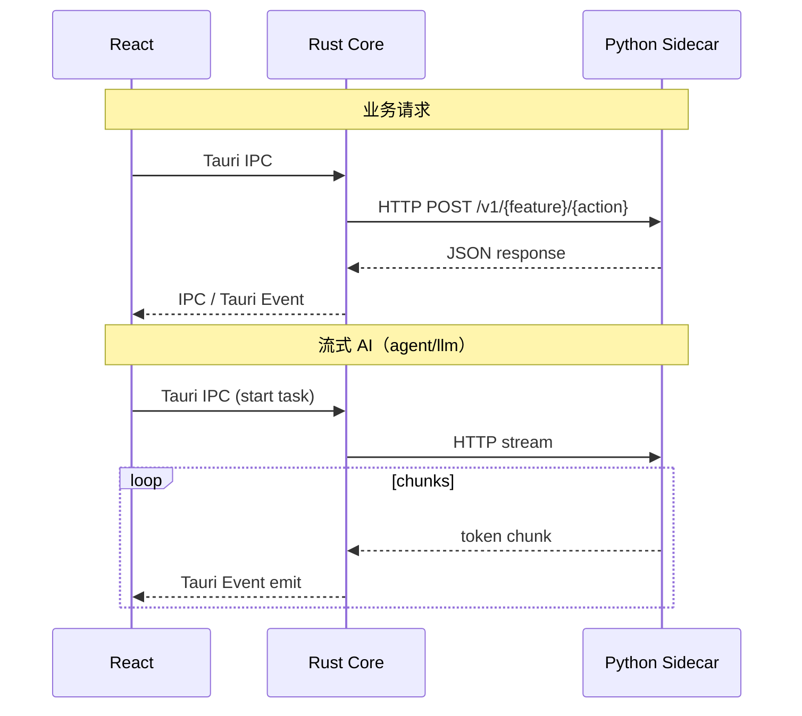

# Rust ↔ Python IPC

Rust Application Core 与 Python Sidecar 之间的**本机 HTTP** 通讯规范。  
React **禁止**参与此层；流式输出由 Rust 转发为 Tauri Events。

## 通讯模型



## 路径约定

| 类型 | 路径 |
|------|------|
| 管理面 | `/health` `/stats` `/tasks/active` `/metrics` `/debug/dump` |
| 业务面 | `/v1/{feature}/{action}` |

OpenAPI 基线：`contracts/openapi/sidecar.v1.yaml`  
业务路径片段：`contracts/openapi/sidecar.paths/<feature>_<action>.yaml`

## 契约

```
contracts/schema/v1/<feature>/sidecar/<action>.request.schema.json
contracts/schema/v1/<feature>/sidecar/<action>.response.schema.json
```

变更顺序：**Contract → Rust runtime client → Python handler**

## 代码位置

| 层 | 路径 |
|----|------|
| Rust 生命周期 + 端口 | `crates/runtime/` |
| Rust HTTP 客户端 | `crates/runtime/src/sidecar/client.rs` |
| Rust 路由绑定 | `crates/runtime/src/sidecar/routes/<feature>_<action>.rs` |
| Python 处理器 | `python/packages/gateway/src/gateway/handlers/` |
| Python 路由表 | `python/sidecar/routes.py` |

## 脚手架

```bash
python skills/opendesk/scripts/create_rust_python_ipc.py --feature agent --action ping
python skills/opendesk/scripts/create_rust_python_ipc.py --feature agent --action run_task --streaming
```

## 禁止

| 禁止 | 原因 |
|------|------|
| React → `http://127.0.0.1:*` | 必须经 Rust |
| Python → Tauri Events | Python 不知道前端 |
| Python → SQLite | 存储归 Rust |
| 无 Contract 的 ad-hoc JSON | Contracts First |

## 相关

- [ipc.md](ipc.md) — React ↔ Rust（Tauri IPC）
- [python.md](python.md)
- [rust.md](rust.md)
- [../recipes/add-rust-python-ipc.md](../recipes/add-rust-python-ipc.md)
- [../examples/rust-python/README.md](../examples/rust-python/README.md)
